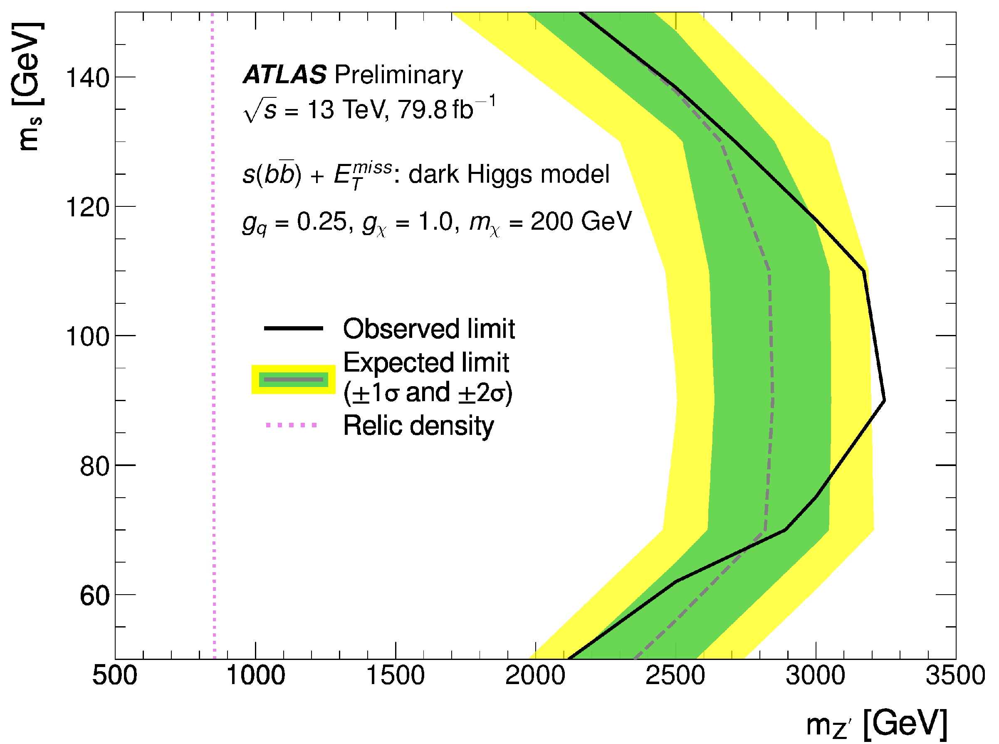
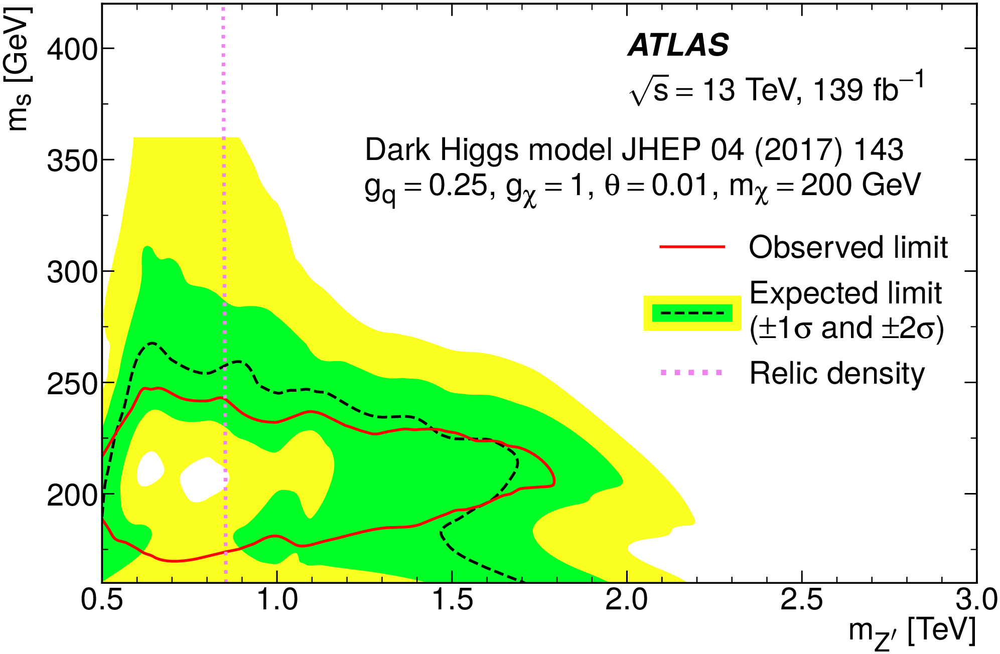

## Introduction
This tutorial provides a hands-on introduction to using docker and gitlab to preserve and re-interpret ATLAS analyses using a tool called RECAST (Request Efficiency Computation for Alternative Signal Theories).

### Plausible and Likely Scenario

To understand why analysis preservation and re-interpretation is important, consider that it can take months or even years for a multi-person analysis team to develop cuts that optimally carve out a phase space sensitive to the model they want to test, and estimate the standard model backgrounds and systematics in this phase space.

Years later, other physicists may dream up new models that would show up in the same or similar phase space as your original analysis. Since the cuts and standard model background estimates won't be affected by considering different signal models in the same phase space, it would probably be way faster for them just to make some tweaks to the original analysis to re-run it with the new models. But the original analysts have moved on, and even if they can dig up the analysis code, they may not remember exactly how to use it or what sort of environment they were running it in.

This is where RECAST comes in! RECAST automates the process of passing a new signal model through an analysis at the time that the analysis is being developed. The idea is that the analysis can then be trivially reused at any time in the future to re-interpret new signal models in the phase space that it so painstakingly revealed.

All this RECAST business may seem like a thing of the future in ATLAS. But, as of August 2019, is officially a thing of the **now**, though it has been used since Run1 in some cases! One recent example is the [mono-Hbb dark matter search](https://atlas.web.cern.ch/Atlas/GROUPS/PHYSICS/CONFNOTES/ATLAS-CONF-2018-039/), which looks for dark matter production in association with a Higgs boson decaying to a pair of b-quarks.  This search has been [re-interpreted in the context of replacing the standard model Higgs decay with a dark sector Higgs](https://atlas.web.cern.ch/Atlas/GROUPS/PHYSICS/PUBNOTES/ATL-PHYS-PUB-2019-032/) decaying to two b-quarks. In this case, the mass of the thing decaying to two b-quarks differs and so although the selections may not be optimal, they get you 95% of the way there with 5% of the work.  This re-interpretation was done using the RECAST framework set up by the mono-Hbb analysis!

This does two things for us. (1) It allows us to quickly make a quantitative statement about a new BSM model - __presumably useful for guiding theorists__. (2) It guides us to appreciate which regions of phase space are not yet covered by our searches - __useful for guiding ourselves__.  This was the case here, where you can see a drop in the sensitivity
at high dark Higgs masses, which motivated an entirely [new search for the WW decay mode of this dark Higgs](https://atlas.web.cern.ch/Atlas/GROUPS/PHYSICS/PAPERS/EXOT-2018-40/) which probes higher masses, but is not sensitive at low masses.  That's alright though, because those have already been covered by our initial RECAST-ed search.

However, there are many more examples of analyses that have implemented and used RECAST to great effect throughout the collaboration.  A non-exhaustive list from the SUSY and Exotics group is :
  - Run1 : pMSSM-19 Paper
  - Run1 : DM pMSSM-5 EWKH
  - Run1 : Gauge Mediated Models
  - Run2 : RPV-RPV
  - Run2 : Exotics DM Summary
  - Run2 : LLP ID+MS displaced search

This is now becoming "a thing" and although the specific requirements may differ from group to group, a generic checklist of what is means for an analysis to be RECAST-ed can be found here - [Link to RECAST Checklist](https://recast-docs.web.cern.ch/recast-docs/publications/).  So, whatever the conveners say, if you follow the guidance there, and in the documentation surrounding it, then you will be just fine going towards approval.

> ## Other RECAST resources
> The "[Link to RECAST Checklist](https://recast-docs.web.cern.ch/recast-docs/publications/)" above points to one section of the official recast documentation.  You should be viewing this tutorial as an inroad to learning how to preserve your analysis but by no means the end-all be-all.  There is considerable functionality that is not covered here and many more views of these toolsIn addition to this tutorial, there are many other resources available for RECAST, including recorded presentations and communication support channels:
>
> * [Official RECAST documentation](https://recast-docs.web.cern.ch/recast-docs/) : Jump in here to start.  These docs are beyond the beta version and serve as a nice guide by themselves.
> * [Discourse](https://atlas-talk.web.cern.ch/c/recast) : Please ask your question here before the mattermost or email list.
> * [Mattermost Channel](https://mattermost.web.cern.ch/atlas-ap/channels/town-square) : But if you can't find the answer on the docs or discourse then ping a channel here
> * [atlas-phys-exotics-recast@cern.ch Mailing list](mailto:atlas-phys-exotics-recast@cern.ch) : Finally, if you detest discourse for whatever reason, no one responds synchronously on mattermost, and you are stumped, don't hesitate to send a mail.
> * [ATLAS Weekly Talk on Analysis Preservation](https://indico.cern.ch/event/793316/contributions/3295488/attachments/1786861/2909640/AP_RECAST_Weekly.pdf)
> * [Exotics Tutorial 2018-11-19](https://indico.cern.ch/event/771214/)
> * [Exotics Tutorial 2018-11-12](https://indico.cern.ch/event/768607/)
> * [SUSY Tutorial 2018-11-08](https://indico.cern.ch/event/763748/)
> * [Docker Tutorial Induction Week 2019-01-31](https://indico.cern.ch/event/772589/contributions/3210539/attachments/1788754/2913246/DockerSWTutorial.pdf)
> * [GitLab Tutorial Induction Week 2019-01-31](https://indico.cern.ch/event/772589/contributions/3210424/attachments/1788725/2913191/20190131_ContinuousIntegration_ATLASInductionWeek.pdf)
>
> So if you find yourself saying "Acgh, I can't figure this one thing out, RECAST is stupid and I'll wait until its useable", then hold your horses and dive into these materials or ask a friend.  We believe in you!
{: .callout}

## Three Key Components of RECAST

### Analysis code preservation

Analysts write a custom code framework that they pass data and signal/background MC through to search for a particular physics model in the data. The first part of analysis preservation is therefore to preserve this code framework. Gitlab is great for this. It fully preserves not only the final version of the code, but also every single version and offshoot of the code that was ever used by the analysts.

### Environment preservation

However, the code framework is far from standalone. It relies on having specific libraries, compilers, and even operating systems in place, and it may be really fussy about the exact versions of all these dependencies. So the second part of analysis preservation is to capture the exact environment in which the code was run by the original analysts. This is where docker comes in.

ATLAS has developed [version-controlled docker base images](https://hub.docker.com/u/atlas) that encapsulate the OS, compilers, standard libraries, and ATLAS-specific dependencies commonly used in ATLAS analyses. Individual searches design custom Dockerfiles in the Github repo(s) to add the analysis code to the base image, along with any analysis-specific dependencies, and then build the code to produce the exact environment needed to run it.

### Automated re-interpretation

The third and final piece of analysis preservation is to fully automate the steps that an analyst would go through in order to pass a new signal model through the analysis chain to arrive at the new result. This is accomplished using a tool called yadage, which allows the user to codify each step of the analysis, which analysis environment (i.e. container) a given step needs to run in, and how each step fits into the overall analysis workflow to arrive at the final result.

## What RECAST does and _doesn't_ Do

Finally, it is important to approach this with a healthy perspective and not drink the kool-aid too much, while also not shorting the functionality of RECAST.  This is a lesson that not only pertains to RECAST but also cryptocurrency and GameStop stock, as we have seen in recent years.

### This does
  - make it easier to onboard new members to your analysis. More personpower for you.
  - make your analysis more useable for "the next" analysis team.
  - mean your analysis can more readily make multiple quantitative statements without approximation.
  - help catch bugs unintentionally introduced (just like and automation and CI).

### This doesn't ...
  - mean your analysis can seemlessly be run on new datasets.
  - mean you can stop thinking or developing your analysis.
  - preserve "intellectual" or "institutional" knowledge.  You still need to produce well-written and concise support notes.
  - produce new ideas.
  - document the exact version of Athena code that was originally used to produce your background and signal DAODs. Your code may not necessarily be compatible with DAODs produced with future releases of the ATLAS derivation framework. Therefore, it would be good document somewhere in your gitlab repo exactly which ATLASDerivation cache and p-tags were used to produce the DAODs used in your analysis (this could just be, eg. a list of all the dataset names used) so other analysts know to produce new signals for RECAST with this same version. See the [DerivationProductionTeam](https://twiki.cern.ch/twiki/bin/viewauth/AtlasProtected/DerivationProductionTeam#Info_on_AtlasDerivation_caches_a) page for more information about derivation production and organzation.

Alright, enough reading, let's start pushing buttons and writing workflows.



