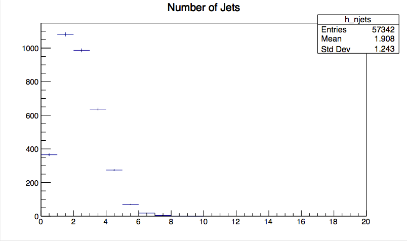
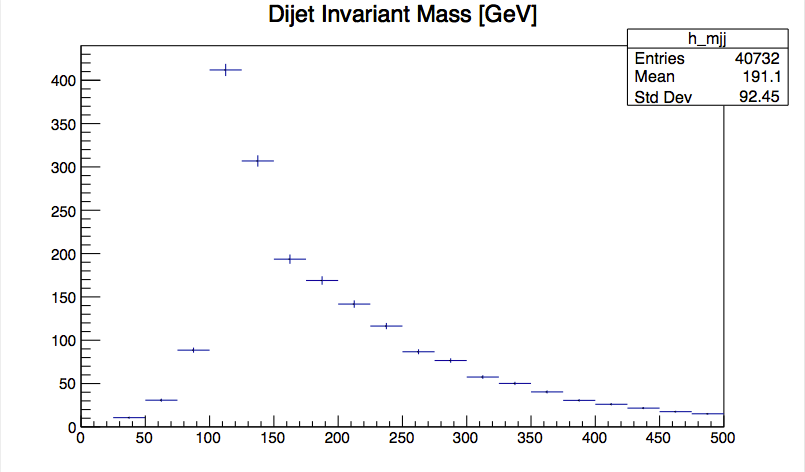

# Introduction

To introduce the RECAST concepts during the tutorial, we'll work on RECASTing a simple stand-alone toy analysis originally developed by Adam Parker, Samuel Meehan and Karol Krizka for the 2019 US-ATLAS computing bootcamp. 

The toy analysis looks at the "VHbb" Higgs search channel, with the Higgs decaying to b-quarks:

For the purposes of this bootcamp, we will be focusing on the channel in which a Z boson decays to
two charged leptons which are either electrons or muons.  This is identified with a Dataset Identifier (DSID) which is
345055.

The challenge of this search is in reconstructing the decay of the Higgs to a pair of b-quarks, which appear in the
detector as hadronic jets ([0712.2447](https://arxiv.org/abs/0712.2447)).  However, if you can correctly identify
the two jets which originate from the Higgs decay, then you can invoke four-momentum conservation and reconstruct
the invariant mass of that decay.

Therefore, throughout this tutorial, this is the primary observable that we will be exploring : **the invariant mass of a pair of hadronic jets**.

# Obtaining the Analysis File

For this toy analysis, we'll only make use of simulated signal, not background - when we get to worrying about backgrounds, they'll just be modeled analytically. 

If you haven't already, please download the sample signal file for the VHbb process with Z decaying to two leptons: [link to analysis file download](https://cernbox.cern.ch/index.php/s/f5DKaHvX1BEEL1Y/download).

A statistically equivalent file can also be downloaded using rucio if preferred:

~~~bash
rucio get --nrandom 1 mc16_13TeV.345055.PowhegPythia8EvtGen_NNPDF3_AZNLO_ZH125J_MINLO_llbb_VpT.deriv.DAOD_EXOT27.e5706_s3126_r10724_p3840
~~~

# Running the Toy Analysis

First, go to [https://gitlab.cern.ch/damacdon/recast-standalone](https://gitlab.cern.ch/damacdon/recast-standalone), and make a personal fork of the `recast-standalone` repo by clicking on the white "Fork" button on the upper right (just next to the blue "Clone" button). Clone your fork of the repo:

~~~bash
# ssh clone (don't need password verification)
git clone --recursive ssh://git@gitlab.cern.ch:7999/[your_username]/recast-standalone.git            

# Or, https clone
git clone --recursive https://gitlab.cern.ch/[your_username]/recast-standalone.git
~~~

If you haven't already, pull the `atlas/analysisbase:21.2.85-centos7` docker image:

~~~bash
docker pull atlas/analysisbase:21.2.85-centos7
~~~

## Set up the AnalysisBase environment

Once the signal DOAD is finished downloading, run the `atlas/analysisbase:21.2.85-centos7` docker image in interactive mode, volume-mounting the data file and current directory to the container:

~~~bash
cd recast-standalone
docker run --rm -it -v /full/path/to/DAOD_EXOT27.17882736._000008.pool.root.1:/Data/signal_daod.root -v $PWD:/Tutorial atlas/analysisbase:21.2.85-centos7 bash
~~~

You should now find yourself in the `atlas/analysisbase:21.2.85-centos7` container, with a command prompt that looks like:

~~~
[bash][atlas]:workdir >
~~~
{: .output}

Source the release setup script to set up the ATLAS release environment:

~~~bash
[bash][atlas]:workdir > . ~/release_setup.sh 
~~~

which should produce:

~~~
Configured GCC from: /opt/lcg/gcc/8.3.0-cebb0/x86_64-centos7/bin/gcc
Configured AnalysisBase from: /usr/AnalysisBase/21.2.85/InstallArea/x86_64-centos7-gcc8-opt
[bash][atlas AnalysisBase-21.2.85]:workdir >
~~~
{: .output}

## Build and run 

Now, cd into the `/Tutorial` directory, and do an `ls` to confirm that it has the same contents as the recast-standalone git repo. Also check that the `/Data` directory contains the signal DAOD file: 

~~~bash
cd /Tutorial
ls
~~~

~~~
README.md  source
~~~
{: .output}

~~~bash
ls /Data
~~~

~~~
signal_daod.root
~~~
{: .output}

If everything is as expected, create `build` and `run` directories, and use `cmake` to compile the code in the `build` directory:

~~~
mkdir build run
cd build
cmake ../source
make
~~~

If the compilation was successful, you can now source `setup.sh` to make the `AnalysisPayload` executable callable from anywhere.

~~~bash
. x86_64-centos7-gcc8-opt/setup.sh
~~~

Now, run the `AnalysisPayload` executable to loop over jets in each event - applying some simple cuts - and produce root histograms with distributions of the number of jets and leading dijet invariant mass. The input signal DAOD, output root file, and number of events to run over are provided as command-line arguments:

~~~bash
cd ../run
AnalysisPayload /Data/signal_daod.root output_hist.root 10000
~~~

Note that we're just limiting the number of events to 10000 for this quick demo run. If no third argument is specified, the executable will by default run over all events in the DAOD. 

If it ran successfully, you should now have a histogram named `output_hist.root` in the current `run` directory, and two pdf files visualizing the hists contained in `output_hist.root`.

~~~bash
ls
~~~

~~~
mjj.pdf			njets.pdf		output_hist.root
~~~
{: .output}

Outside of the container, cd into the `recast-standalone/run` directory (which should have been created since the `recast-standalone` directory was volume-mounted), and open up the pdf files with a pdf viewer. Check that they look something like:

> ## Exercise (15 min)
> Outside of the container, open up the `AnalysisPayload.cxx` source file, located in `recast-standalone/source/AnalysisPayload/utils/AnalysisPayload.cxx` and take some time to go through it and get a feel for what it's doing. If it helps, you can use the following questions as a guide:
>
> **Question 1**
>
> a) Is it necessary to supply command-line arguments to the AnalysisPayload executable? 
>
> b) If we didn't supply command-line arguments, what precautions would we need to ensure that the program runs successfully?
>
> c) What's the purpose of the third optional command-line argument?
>
> **Questions 2**
>
> a) Identify the event loop (i.e. the loop that iterates over each event in the input DAOD file). 
>
> b) Within the event loop, what three values are extracted from the `EventInfo` container for each event? Which of these three values is used later on when filling histograms?
>
> **Question 3**
>
> a) Identify the loop over all akt4 jets in a given event within the event loop. 
> 
> b) Where is the jet quality cut applied?
>
> **Question 4**
>
> What's the purpose of the `mcEventWeight` argument to the `Fill()` function on lines 80 and 83?
>
> **Question 5**
>
> How does the dijet invariant mass calculation on line 83 ensure that the two leading jets - i.e. the jets with the highest transverse momentum (pT) - are being selected?
>
> > ## Solution
> > **Question 1**
> > a) No, it's not necessary, but you need to be careful if you don't (see part b)
> > 
> > b) We'd need to ensure that the DAOD was named DAOD_EXOT27.17882736._000019.pool.root.1 and located in a directory called `mc16_13TeV.345055.PowhegPythia8EvtGen_NNPDF3_AZNLO_ZH125J_MINLO_llbb_VpT.deriv.DAOD_EXOT27.e5706_s3126_r10724_p3840` located in the `run` directory (or wherever we run the `AnalysisPayload` executable from)
> > 
> > c) The third optional command-line argument (line 35) allows the user to specify the number of events to run over, rather than the default of running over all events in the file. This can be useful when you just want to run over a small subset of the events for quick debugging.
> > 
> > **Question 2**
> > 
> > a) The event loop is the `for()` loop that runs over event indices from 0 to `numEntries`. It spans lines 51-88.
> > 
> > b) The three values extracted from the `EventInfo` container are:
> > 
> >  * runNumber, 
> > 
> >  * eventNumber, and 
> > 
> >  * the 0th element of the `mcEventWeights` vector, representing the "nominal" MC event weight. 
> > 
> > The nominal `mcEventWeight` is used later on to weight the events when adding them to histograms. 
> > 
> > **Question 3**
> > 
> > a) The loop over all akt4 jets in a given event spans lines 70-77.
> > 
> > b) The jet quality cut is applied with the `if( myJetTool.isJetGood(jet) )` condition on line 74.
> > 
> > **Question 4**
> > 
> > The `mcEventWeight` argument to `Fill()` weights each event by the `mcEventWeight` attributed to the event by the event generator before filling the histogram with the event. 
> > 
> > **Question 5**
> > 
> > Jets are in general stored vectors in order of descending pT, so choosing the 0th and first elements of the `signal_jets` vector (after checking that it actually has at least two elements) automatically ensures that we're getting the leading-pT jets. Sorry if that seemed like a trick question, I just wanted to bring it up because it wasn't obvious to me when I first started working with jet vectors...).
> {: .solution} 
> 
{: .challenge}

 


