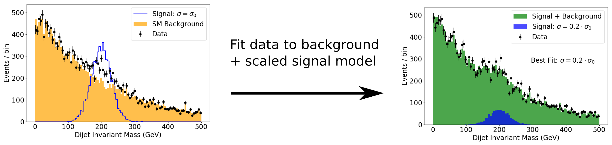
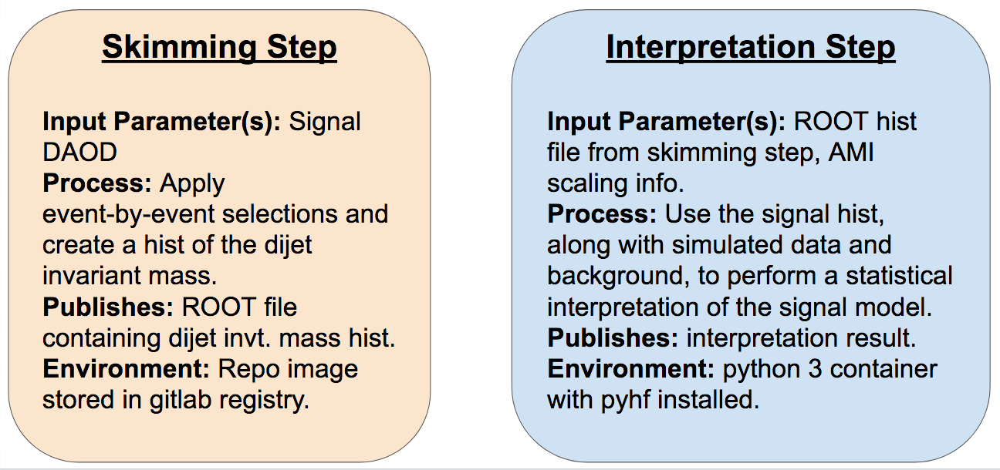
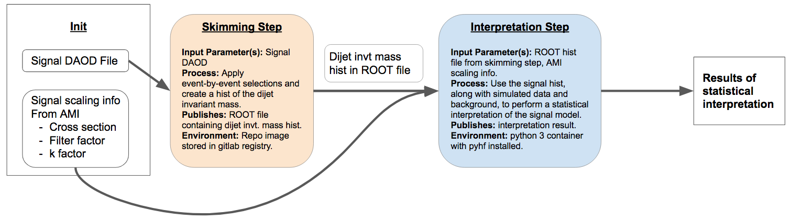

## Introduction

### Interpreting our Analysis

So far in our VHbb analysis, we've taken a Monte Carlo simulated signal DAOD, looped through this MC data event-by-event, applied some kinematic selections, and output the data to a histogram of the dijet invariant mass. But what we really want to do in the end is compare our simulated signal sample with data from the ATLAS detector to determine whether we can see our signal in the data, and if so, to what extent. In a real analysis, a proper comparison with the data would require accounting for all the events from SM background processes that make it through our selection, and adding these events to our histograms. We could then perform a fit to determine whether the observed data is best explained by the SM background alone, or by some combination of the background and signal - in which case we can claim to have "seen" our signal in the data. 

However, the time it would take us to properly account for all the SM backgrounds would probably take away from the main purpose of this tutorial, which is to look at how docker is being used in ATLAS analysis. So we'll instead assume that our SM background distribution can be modeled analytically by some smoothly decaying exponential in the dijet invariant mass, and move along (keeping in mind that this would in no way fly in a real analysis!). We'll also provide toy data for the interpretation, which will be statistically drawn from the exponentially falling SM background, plus *some* non-background component that we're hoping to model. The fit will be done using a python fitting framework called [pyhf](https://diana-hep.org/pyhf/).

This approach is illustrated in the following doodle, where some data is fit with the background plus signal, with the signal amplitude (linearly proportional to the cross section) allowed to vary, and the fit shows that the data is best represented with a signal component, where the signal cross section is 1/5th of its simulated value. Note that the signal in this doodle is **not** meant to represent the particular signal we get from our DAOD, it's just drawn from a Gaussian distribution for illustration.

 

### Analysis Preservation and Re-interpretation
Thanks to gitlab and docker, we've now successfully preserved our analysis code and the environment in which we run it. The final piece of RECAST analysis preservation is to preserve our analysis workflow for interpreting the signal as described above, and automate the process of passing an arbitrary signal model through the workflow to re-interpret the analysis in a new context. 

If it weren't for the docker containers involved in RECAST, this could conceivably be accomplished with some environment variables and bash scripts that just list out each command that an analyst would type into the terminal while going through the analysis. But when we perform the analysis steps in one or more docker containers, we need a way to codify what needs to happen in which container for each step, and how the output from one step feeds as the input for later steps, which may in general need to be done in different containers. Lukas Heinrich has written a great tool called "yadage" to handle this situation. Before diving into the gory details of how to actually program with yadage, let's start with a high-level overview of what it is and how it accomplishes the goal of preserving and re-interpreting our analysis.

> ## Background preservation
> In our sample analysis, we're using an analytic falling exponential as our background, but a real ATLAS analysis will have many different sources of background, each obtained from its own set of DAODs, and involving its own set of systematics that will affect the fit result. Since these background contributions won't change when the analysis is re-interpreted with a new model, it's in general important to preserve the contribution of these backgrounds to the final analysis results in the analysis code so that only need to run the signal DAOD through the whole analysis chain when the analysis is re-interpreted with RECAST. 
>
>   
{: .callout}

## Yadage

[Yadage](https://yadage.readthedocs.io/en/latest/) is both:
 * a syntax for describing workflows made up of containerized steps, and 
 * an execution engine for actually running these workflows. 

We'll get into the syntax part of yadage in the upcoming *intermezzo*, during which you'll get to practice writing a basic helloworld workflow in yadage. But before venturing too far into the forest of syntax, let's first fly overhead and see where this is all going. 

In the yadage approach, the workflow is divided into distinct steps, called packaged activities - or "packtivities" - each of which will run inside a docker container. The steps get linked into a workflow using something called a dynamic acyclic graph (DAG). 

## Steps

Each step in the workflow is fully described by:
* **Publisher descriptions:** The input data that the step receives from previous step(s) - or from the user if it's the first step in the workflow - and the output that it sends - i.e. "publishes" - to the next step.
* **Process description:** Instructions - typically a bash command or script - for transforming the input data into output to be fed into the next step, or the final result if it's the last step in the workflow
* **Environment description:** The environment in which the instructions need to be executed. This is specified by the image used to start the container in which the step will run.

The three steps involved in interpreting our VHbb analysis are as follows:

* **Skimming Step:** This is the step that we're already familiar with, where we take in the signal DAOD, loop through it event-by-event, apply some selections, and output a histogram of the dijet invariant mass variable that we'll want to fit our model to the data. This step will take place in the custom `AnalysisBase` container we recently created for our analysis repo. 
* **Reformatting Step:** The pyhf fitting framework that we'll use for re-interpretation is written in pure python and runs outside of ROOT, so we can simplify the fitting step by reformatting the histogram that we wrote to a ROOT file in the previous skimming step into a json file that is readable in pure python, and outputting this json file to the fitting step.  
* **Fitting Step:** Here, we use pyhf to do our statistical analysis of the signal, background, and data to determine whether we can detect our signal model in the data. We need some extra pieces of information to scale the signal appropriately, which we can get from the AMI database (this will be discussed further soon). 

These steps are summarized in the following illustration:

 

## Workflow

The workflow description specifies how all the steps "fit together". It accomplishes this by specifying exactly where all the data to be input to each step comes from - whether it be user-provided (i.e. "init" data) or output from a previous step - and how each step will be executed.

So here is an idea of what our workflow should look like:

 

> ## Exercise
> Looking at the workflow, you'll notice that the signal DAOD file gets passed to the analysis code in the first skimming step. Since our ultimate goal with RECAST is to make it possible to trivially re-interpret our analysis with any signal model, we should be able to pass any signal DAOD to this skimming step, not just the one we've been working with so far. It would also be good for clarity (and in fact necessary if we wanted to start considering different background samples) to be able to specify the name of the ROOT file containing the output histograms depending on the input DAOD. But at present, the filename and path to the input signal DAOD and output ROOT file are hard-coded into the AnalysisPayload.cxx code. 
>
> So, with an eye on re-interpretation, update the AnalysisPayload.cxx in your gitlab repo so it can read in both:
> * the path to the input DAOD, and 
> * the path to the output ROOT file that will contain the histograms created by AnalysisPayload.cxx
> 
> such that the `AnalysisPayload` executable can be executed as follows:
> ~~~
> AnalysisPayload /path/to/input/DAOD.root.1 /path/to/output/ROOT/file.root
> ~~~
> {: .source}
> > ## Solution
> > The updates should look something like:
> > 
> > 1. `int main() {` --> `int main(int argc, char *argv) {`
> > 
> > 2. `TString inputFilePath = /path/to/ROOT/file.root.1;` becomes:
> > ~~~
> > TString inputFilePath = argv[1];
> > TString outputFilePath = argv[2];
> > ~~~
> > {: .source}
> > 
> > 3. `TFile *fout = new TFile("myOutputFile.root","RECREATE");` --> `TFile *fout = new TFile(outputFilePath), "RECREATE");`
> {: .solution}
{: .challenge}

> ## Hints
> This should only require changing three lines in AnalysisPayload.cxx
> 
> The simplest way to implement command-line arguments in C/C++ is by passing the number `argc` of command line arguments and the list `*argv[]` of arguments to the `main()` function (see eg. this quick [cplusplus.com tutorial](http://www.cplusplus.com/articles/DEN36Up4/)).
{: .callout}



