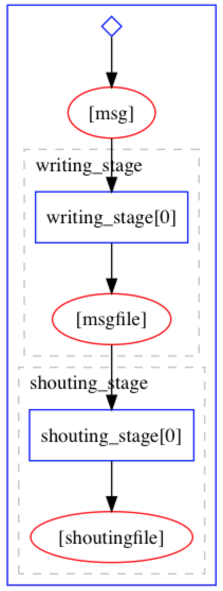

--- 
title: "Intermezzo: Yadage Helloworld"
teaching: 10
exercises: 20
questions:
- "None"
objectives:
- "Get acquainted with a simple helloworld yadage workflow."
- "Learn about some of the dubugging tools that are at your disposal for developing workflows."
keypoints:
- "The format and syntax for defining yadage workflows takes some getting used to."
- "Yadage includes some very handy validation and debugging tools for developing your steps and workflow."
- "The good news is that the basic workflow we've written here probably showcases most of the syntax you'll need to write a full RECAST workflow."

---

## Introduction

In this *intermezzo*, we'll take our first step into the forest of workflow authoring by walking through a simple helloworld example that illustrates the yadage syntax involved. The original example, written by Lukas Heinrich, is available here: [Getting Started Tutorial](https://yadage.github.io/tutorial/GettingStarted.html). Once you've mastered this basic workflow, it should be relatively straightforward to extend it to more complex workflows. 

The goal of the workflow is to take an input message, concatenate it with another (fixed) message, and then capitalize the new concatenated message and output it to a file. This is accomplished in two steps, as shown in the following workflow diagram:

 

The containers containing the environment and executables needed run each of the two steps are already available on docker hub. For the purpose of writing our workflow, we're not really concerned with the code that actually produces the executables. All we need to know how to run them inside their respective containers.

* [https://hub.docker.com/r/yadage/tutorial-messagewriter/](https://hub.docker.com/r/yadage/tutorial-messagewriter/): contains a compiled C++ executable that takes a message and a path to an output file, concatenates the message onto `Hello, the message was: `, and writes the concatenated message to the output file. Try running it yourself! We'll volume-mount your current working directory to the container so that the output file will persist after the container exits. 

~~~
docker run --rm -it -v $PWD:/workdir yadage/tutorial-messagewriter sh
/code/message_writer hello /workdir/outputfile.txt
~~~
{: .source}

You can then exit the container and check that your working directory now has a file outputfile.txt, which has some text written in it. 

* [https://hub.docker.com/r/yadage/tutorial-uppermaker/](https://hub.docker.com/r/yadage/tutorial-uppermaker/): contains a python script that takes paths to input and output files as command line arguments. It capitalizes the contents of the input file and writes the result to an output file. Let's try this out! We'll again volume mount our working directory and feed the output file from the last step into the program to see what happens to it:

~~~
docker run --rm -it -v $PWD:/workdir yadage/tutorial-uppermaker sh
python /code/uppermaker.py /workdir/outputfile.txt /workdir/capped_output.txt
~~~
{: .source}

Again, you can exit the container and confirm that your working directory now has a file `capped_output.txt` containing the capitalized text. 

The workflow we're about to construct essentially does the role of automating the procedure we just went through by hand. 

### Steps 

The two steps in our workflow are encoded in a yaml file steps.yml. Make a directory named `workflow` somewhere on your computer, cd into it, and create an empty file named `steps.yml`.

#### Message Writing Step

Paste the following into your `steps.yml` file:

~~~
messagewriter:
  process:
    process_type: interpolated-script-cmd
    script: |
      /code/message_writer '{message}' {outputfile}
  publisher:
    publisher_type: interpolated-pub
    publish:
      msgfile: '{outputfile}'
  environment:
    environment_type: docker-encapsulated
    image: yadage/tutorial-messagewriter
~~~
{: .source}

This code fully describes the first step of taking the input message and using the `message_writer` executable to produce the output file. Let's look at the three components separately:

* The `process` component specifies the type and content of the process that the container will run. The process type `interpolated-script-cmd` means that it runs a bash script that can include variables denoted by {curly brackets}. This is quite possibly the only type of process you'll ever need to use for RECAST.

* The `publisher` component specifies how the output of the step will be published (in this case `interpolated-pub`), and what variable(s) it will be published to. 

* The `environment` component indicates that the script will be run inside a docker container produced from the base image `yadage/tutorial-messagewriter`.

We can use the `packtivity-validate` command to check that we wrote this specification correctly:

~~~
packtivity-validate steps.yml#/messagewriter
~~~
{: .source}

~~~
packtivity definition is valid
~~~
{: .output}

We can now use a very helpful debugging tool called `packtivity-run` to try executing the task as a standalone `packtivity`, where we specify both the message and the location of the output file:

~~~
packtivity-run steps.yml#/messagewriter -p message="Hi there." -p outputfile="'{workdir}/outputfile.txt'" 
~~~
{: .source}

You can now check that a file `outputfile.txt` has been produced in the current directory with the expected output. Note that you'll need to remove the `_packtivity` directory before running the `packtivity-run` command again, otherwise the command will crash with a message like this:

~~~
w134-87-144-175:workflow danikam$ packtivity-run steps.yml#/messagewriter -p message="Hi there." -p outputfile="'{workdir}/outputfile.txt'" 
<TypedLeafs: {'msgfile': '/Users/danikamacdonell/workflow/outputfile.txt'}> (prepublished)
2019-08-06 11:39:06,301 | pack.packtivity_sync |   INFO | starting file logging for topic: step
2019-08-06 11:39:07,704 | pack.packtivity_sync | WARNING | cid file /Users/danikamacdonell/workflow/_packtivity/packtivity_syncbackend.cid seems to exist, container execution will crash
~~~
{: .output}

#### Shouting Step

Now, add the following to your steps.yml file to describe the second step which will take the file produced by the first step, and write the capitalized contents to an output file. 

~~~
uppermaker:
  process:
    process_type: interpolated-script-cmd
    script: |
      python /code/uppermaker.py {inputfile} {outputfile}
  publisher:
    publisher_type: interpolated-pub
    publish:
      shoutingfile: '{outputfile}'
  environment:
    environment_type: docker-encapsulated
    image: yadage/tutorial-uppermaker
~~~
{: .source}

You can validate and test this step using the same `packtivity-validate` and `packtivity-run` tools as before, where the `packtivity-run` command would be:

~~~
packtivity-run steps.yml#/uppermaker -p inputfile="'{workdir}/outputfile.txt'" -p outputfile="'{workdir}/capped_output.txt'" 
~~~
{: .source}

> ## Debugging Hint
> When `packtivity-run` fails and crashes, the info in its core dump can sometimes be a little cryptic. But if you look in the `_packtivity` directory that gets created when you run `packtivity-run`, you'll find several log files, and usually one of them (often `packtivity_syncbackend.run.log`) will be able to point you to the cause of the crash.
{: .callout}

### Workflow

Now we can combine the two steps specified above together to form the full workflow. Create a new file named workflow.yml, and paste the following into it:

~~~
stages:
- name: writing_stage
  dependencies: [init]
  scheduler:
    scheduler_type: singlestep-stage
    parameters:
      message: {step: init, output: msg}
      outputfile: '{workdir}/outputfile.txt'
    step: {$ref: 'steps.yml#/messagewriter'}
- name: shouting_stage
  dependencies: [writing_stage]
  scheduler:
    scheduler_type: singlestep-stage
    parameters:
      inputfile: {step: writing_stage, output: msgfile}
      outputfile: '{workdir}/capped_output.txt'
    step: {$ref: 'steps.yml#/uppermaker'}
~~~
{: .source}

Each stage in the workflow specifies:

* its `dependencies` - i.e. which stage(s) it receives input from, and which will therefore need to complete before the stage in question can start running. The [init] stage represents any input that comes from the user when the workflow is started. 
* The type `scheduler_type` of scheduler it needs to run. This could be either a `singlestep-stage` or a `multistep-stage` (we'll only consider single-step stages in this tutorial).
* The `parameters` - i.e. how to obtain the input and write the output for the step. 
* And, of course, which `step` it needs to run. 

### Validating and Running

Finally, let's validate the workflow using the `yadage-validate` command line tool:

~~~
yadage-validate workflow.yml
~~~
{: .source}

If there are no errors, we can go ahead and try running the full yadage workflow with `yadage-run`:

~~~
yadage-run workdir workflow.yml -p msg='Hi there.'
~~~
{: .source}

If the workflow runs successfully, you should find the file `capped_output.txt` in the `workdir/shouting_stage` directory, with the following content:

~~~
HELLO, THE MESSAGE WAS: HI THERE.
~~~
{: .output}

Note that, as with the `packtivity-run` command, you'll need to remove the `workdir` directory produced by the `yadage_run` command before you can re-run the command.

> ## Debugging Hint
> As with `packtivity-run`, the `yadage-run` command also produces log files for each step that can be super handy for debugging. These are located in the respective `_packtivity` directory for each step. For example, the log files for the second `shouting_stage` step are located in `workdir/shouting_stage/_packtivity/`. 
{: .callout}



