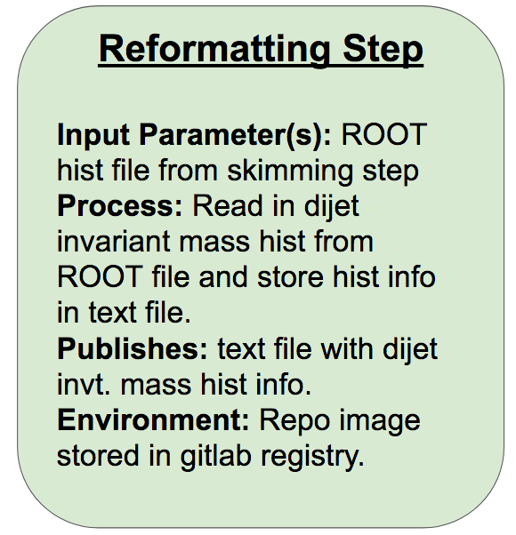

## Introduction

We now have all the Yadage tools we need to put together our VHbb RECAST workflow, starting by "yadage-ifying" our three analysis steps using the syntax we learned during the intermezzo. First, we'll create a new gitlab repo to contain our analysis workflow. 

### Skimming Step

We can use essentially the same yadage structure and syntax for defining our analysis steps as we did for the message writing and shouting steps we saw in the intermezzo. So let's start with this structure and fill it in with the information needed to run the `AnalysisPayload` skimming step of our workflow. In your browser, navigate to `https://gitlab.cern.ch/` and click the green `New Project` button. Give your project a name (eg. `my-workflow`), set the visibility level as desired, and click `Create Project`. Now you can copy the repo url from the browser and clone your new project onto your computer:

~~~
git clone [repo url].git
~~~
{: .source}

> ## Exercise
> 
> Working from your shell, cd into your new workflow repo, and create your empty steps.yml and workflow.yml files. Fill in the FIXMEs in the following skeleton code to encode the first skimming step of the analysis 
> ~~~
> [Skeleton for skimming step with FIXMEs will go here]
> ~~~
> {: .source}
> > ## Solution
> > [Solution with FIXMEs filled in will go here]
> {: .solution}
{: .challenge}

### Reformatting Step

In this step, we read in the dijet invariant mass histogram `h_mjj_kin` that was written out to a ROOT file in the last step, and write it out to a text file so it can be easily read in by the final interpretation step. The required format of the output text file is space-separated histogram bin edges in the first row and space-separated bin contents in the second row. For a five-bin triangle-shaped histogram with bin edges ranging from 0 to 10, for example, the contents would be:

~~~
0.0 2.0 4.0 5.0 6.0 8.0
0.0 1.0 2.0 1.0 0.0 
~~~
{: .output}

You can try setting up the container for this step yourself in the following exercise.

> ## Exercise
> 
> #### Part 1
> On your local machine, create a new file named ReformatHist.cxx in your AnalysisPayload sub-repo to contain code that will receive as input the path to the ROOT file containing the histograms written out by `AnalysisPayload`, and outputs the text file described above. Now, `cd` up into the main repo and run a container from the `atlas/analysisbase:21.2.75` image, volume-mounting the whole analysis repo into the container, as well as the ROOT histogram file that you previously produced with the `AnalysisPayload` executable.
> #### Part 2
> Now, add a new executable to your CMakeLists.txt file in AnalysisPayload named ReformatHist that will run the code. Consider which libraries will actually need to be linked, and which ones can be safely omitted for this executable. 
> 
The command to run the finalized executable will be:
> ~~~
> ./ReformatHist /path/to/ROOT/file /path/to/text/file
> ~~~ 
> #### Part 3
> Fill in ReformatHist.cxx so the corresponding ReformatHist executable can accomplish the task described in part a. Remember to `#include` any needed libraries. You can compile and test the code in the container as you work. 
> #### Part 4
> When you're satisfied with the result, you can commit and push your updates to your AnalysisPayload sub-repo from your local machine. Remember to update your main repo so that it uses the updated AnalysisPayload commit. Check to ensure that the new image builds on gitlab without any errors. 
> > ## Solution
> > #### Part 2
> > The addition to CMakeLists.txt should look like:
> > ~~~
> > ATLAS_ADD_EXECUTABLE ( ReformatHist AnalysisPayload/ReformatHist.cxx
> >                      INCLUDE_DIRS ${ROOT_INCLUDE_DIRS}
> >                      LINK_LIBRARIES ${ROOT_LIBRARIES})
> > ~~~
> > #### Part 3
> > ReformatHist.cxx should look something like:
> > ~~~
> > // stdlib functionality     
> > #include <iostream>
> > #include <fstream>
> > 
> > // ROOT functionality
> > #include <TFile.h>
> > #include <TH1D.h>
> >
> > int main(int argc, char **argv) {
> > 
> >   // Open the input file
> >   TFile *f_in = new TFile(argv[1]);
> >
> >   // Collect the histogram from the file                                                                                                                             
> >   TH1D * hist = (TH1D*)f_in->Get("h_mjj_kin");
> >
> >   // Write the bin edges and contents to the output file
> >   std::ofstream f_out(argv[2]);
> >
> >   // First write the bin edges
> >   double bin_width = hist->GetBinWidth(1);   // Needed for computing last bin edge
> >   int n_bins = hist->GetNbinsX();
> >
> >   for(int iBin=1; iBin < n_bins+1; iBin++)
> >   {
> >     f_out << hist->GetBinLowEdge(iBin) << " ";
> >   }
> >
> >   f_out << hist->GetBinLowEdge(n_bins) + bin_width << std::endl;
> >
> >   // Now write the bin contents
> >   for(int iBin=1; iBin < n_bins+1; iBin++)
> >   {
> >     f_out << hist->GetBinContent(iBin) << " ";
> >   }
> >
> >   f_out.close();
> > }
> > ~~~
> > {: .source}
> {: .solution}
{: .challenge}

> ## Bonus Exercise!
> The task we accomplished above in pure ROOT could also be accomplished with a fair bit less coding by making use of python's uproot or rootpy+root_numpy packages. Since the amount of data encoded in the histograms is very small compared with the original DAOD, any speed losses we may suffer in going from pure ROOT code to python for this step are essentially negligible. As such, this is a situation in which it may well be to our benefit to take advantage of high level python modules. The main downside in our particular case is that `atlas/analysisbase:21.2.75` doesn't have a ROOT installation with python bindings (needed for rootpy+root_numpy) or python 3.6 (needed for uproot), so it's best to build or own docker images for this task. 
> 
> we provide "starter" repos for . You can choose to work with one of them depending on your desired implementation. 
>
> Each repo includes:
> * a Dockerfile which specifies the base image and installs any required dependencies (feel free to add more dependencies if you need to!), 
> * a source code file to start with that includes/imports the libraries/modules that you're likely to need (feel free to add more if needed!), and some guiding comments.
> 
> ### Starter repos
> 
> * **uproot ([link to gitlab repo](https://gitlab.cern.ch/damacdon/uproot)):** The Dockerfile starts from the official python:3.6 base image, and installs the uproot python module on top of it. The [uproot.open function](https://uproot.readthedocs.io/en/latest/opening-files.html#uproot-open) can convert the ROOT file into a "ROOTDirectory" object, from which the `h_mjj_kin` can be read and converted to a numpy array with the `numpy()` function, [as described in the github README](https://github.com/scikit-hep/uproot#histograms-tprofiles-tgraphs-and-others).
>
> * **rootpy_numpy ([link to gitlab repo](https://gitlab.cern.ch/damacdon/rootpy_numpy)):** The Dockerfile starts from a centos7 image with ROOT (+python2.7 bindings) pre-installed, and   installs the rootpy and root_numpy python modules on top of it. rootpy's [root_open](http://www.rootpy.org/reference/generated/rootpy.io.root_open.html) function can be used to read in the `h_mjj_kin` histogram from the ROOT file (this part is already filled in since the online documentation isn't very thorough), and root_numpy's [hist2array](http://scikit-hep.org/root_numpy/reference/generated/root_numpy.hist2array.html) function can be used to convert the ROOT histogram to a numpy array.
> 
> Make a personal fork of the repo you want to work with (or try making your own from scratch if you're wanting an extra challenge!), and make any updates you need to the source code and Dockerfile to create the desired executable. Add a .gitlab-ci.yml file to automatically build the docker image when you push commits to the repo. 
> > ## Solution
> > Full working solutions for each repo can be found in the `solution` branch of the repo.
> {: .solution}
{: .challenge}

Now that we've got our environment and executable set up, we can encode this second step in yadage and add it to the steps.yml file:

~~~
reformatting_step:
  process:
    process_type: interpolated-script-cmd
    script: |
      source ~/release_setup.sh		# NOTE: This command shouldn't be needed if you're using an image you produced in the bonus "python-implementation" exercise!
      /build/AnalysisPayload/ReformatHist {inputfile} {outputfile}     # Change the exact run command if your executable has a different name or location
  publisher:
    publisher_type: interpolated-pub
    publish:
      hist_txt: '{outputfile}'
  environment:
    environment_type: docker-encapsulated
    image: [gitlab image in which the ReformatHist executable will run]
~~~
{: .source}



