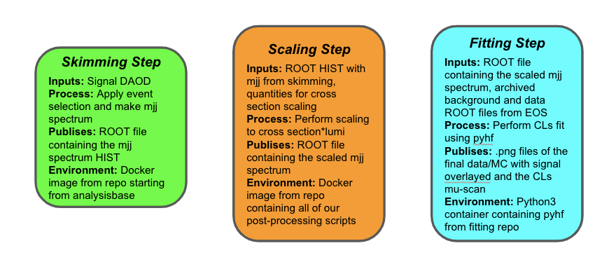

## Interpreting our Analysis

So far in our VHbb analysis, we've taken a Monte Carlo simulated signal DAOD, looped through this MC data event-by-event, applied some kinematic selections, and output the data to a histogram of the dijet invariant mass. And this has now been preserved thanks to docker and GitLab, yay!  But what we really want to do in the end is compare this (presumably new) simulated signal sample with (1) data from the ATLAS detector and (2) our background estimate to determine whether we can see our signal in the data and/or constrain it using some sort of statistical analysis.  We are part of the way there, but not quite finished, since we only have an `mjj` histogram for our signal.

### The RECAST *Reinterpretation* Setup

The conventional RECAST setup that is used to perform reinterpretations is what we will be aiming for in this tutorial.  Our analysis has been done once, meaning that we have already gone through the painstaking work of running over the entire dataset and also performing a careful background estimation, ultimately arriving at a set of histograms that represent these two things : (1) **data** and (2) **background**.  For a reinterpretation, these will remain unchanged and can be "eaten" by a *parameterized* workflow as they are.


Now what we want is to be able to produce a new interpretation and compare signal+background to data for our new signal (first image) as well as a statistical CLs interpretation for this particular signal (second image).

Spectrum of Data/MC        |  Reinterpreted Limit
:-------------------------:|:-------------------------:
   |  


There are three primary additional components that we will need to use within our workflow :
  - **EOS** : For retrieving/storing the workflow inputs and outputs
  - **Post Processing** : For scaling of our signal
  - **Statistical Analysis** : For doing the final fit and interpretation

Let's spend some time getting familiar with these utilities and then we will begin to tie them together into a jazzy workflow using some new tools - [packtivity](), [yadage](), and [recast]().

#### Getting our Data and Background (EOS)
As you have learned in the [HSF GitLab tutorial](), data is preserved and distributed on CERN GitLab via EOS using service accounts. As such, that is where our data and background samples are stored.  More specifically, they are stored at `NEED PATH HERE` and within that file you will find two histograms `background` and `data` which were produced with the same `event-selection` code but running over the entirety of the Run 2 dataset and all MC campaigns ... (not actually, they were produced with [this code](https://gitlab.cern.ch/recast-examples/background-generation) but we are going to pretend for the sake of the tutorial).

#### Processing Stuff
Normally, between doing the event loop and the statistical analysis, you have some set of scripts for processing your histograms, right?  In particular, for scaling your raw histograms to physically meaningful luminosities and cross sections.  For our analysis chain, these utilities are bundled into a docker image `gitlab-registry.cern.ch/recast-examples/post-processing:master` housed at [this repo](https://gitlab.cern.ch/recast-examples/post-processing) though you should not need to look at the code to write your workflow, just know what the parameterized script eats and spits.  For our purposes, the key utility we want is for scaling our signal appropriately.
```
python scale_to_lumi_xsec.py -i selected.root -o selected_scaled.root -p scaled.pdf -c 1 -s 1 -k 1 -f 1 -l 1 -g mjj
```
the arguments are :
  - `-i`: The input file containing the histogram you want to scale
  - `-o`: The output file where you will write the scaled histogram
  - `-p`: The filename for making the debug plot
  - `-c`: cross section
  - `-s`: The sum of event weights
  - `-k`: k-factor
  - `-f`: filter efficiency
  - `-l`: luminosity
  - `-g`: The histogram in the file that is to be scaled

#### Statistical Analysis
The fit will be done using a python fitting framework called [pyhf](https://diana-hep.org/pyhf/).  This has been bundled into a docker image `gitlab-registry.cern.ch/recast-examples/fitting:master` housed at [this repo](https://gitlab.cern.ch/recast-examples/fitting) though if we embrace parameterized code, you shouldn't need to look at the code and your entire workflow can be written by knowing its interface (like all well-written code).

The executable can be executed as
```
python run_fit.py --filesig selected_scaled.root --histsig h_mjj   --filebkg external_data.root --histbkg background  --filedata external_data.root --histdat data --outputfile limits.png --plotfile results.png
```
with the input arguments being :
  - `--filesig`    : The path to the input file containing your signal histogram
  - `--histsig`    : The name of the signal histogram in that file
  - `--filebkg`    : The path to the input file containing your background histogram
  - `--histbkg`    : The name of the background histogram in that file
  - `--filedata`   : The path to the input file containing your data histogram
  - `--histdat`    : The name of the data histogram in that file
  - `--outputfile` : The png (or whatever) file name for saving your limits plot
  - `--plotfile`   : The png (or whatever) file name for saving your data/MC plot

## Why do we need to get fancy and use jazz hands?

If it weren't for the docker containers involved in RECAST, this could conceivably be accomplished with some environment variables and bash scripts that just list out each command that an analyst would type into the terminal while going through the analysis. But when we perform the analysis steps in docker containers, we need a way to codify what needs to happen in which container for each step, and how the output from one step feeds as the input for later steps. This is accomplished through the use of a [declarative]() programming language called [`yadage`]().

Before diving into the gory details of how to actually program with yadage in the next lesson, let's start with a high-level overview of what it is and how it accomplishes the goal of preserving and re-interpreting our analysis.

### Yadage

[Yadage](https://yadage.readthedocs.io/en/latest/) is both:
 * a syntax for describing workflows made up of containerized steps, and
 * an execution engine for actually running these workflows.

We'll get into the syntax part of yadage in the upcoming *intermezzo* lesson, during which you'll get to practice writing a basic helloworld workflow in yadage. But before venturing too far into the forest of syntax, let's first fly overhead and see where this is all going.

In the yadage approach, the workflow is divided into distinct steps, called packaged activities - or "packtivities" - each of which will run inside a docker container. The steps get linked into a workflow by specifying how the output from each such packtivity step feeds in as the input for subsequent steps (this flow of dependencies is not necessarily linear). The yadage workflow engine optimizes the execution of the workflow.  If you want to eat up all the details, then you are encouraged to work through the dedicated [yadage tutorial](https://yadage.github.io/tutorial/) and read the [paper describing the design principles](https://arxiv.org/pdf/1706.01878.pdf)

> ## Declarative Languages
> In this tutorial, we will be using yadage, which itself is an instance of a *declarative* programming language and relies on this concept of "eating" and "spitting".  What goes on under the hood is something that does not concern us when we are programming in a declarative way.  This is opposed to an *imperative* programming language where you write all of the details out that go under the hood (e.g. loops).  There are many other declarative languages (e.g. [serial]() and [snakemate]()) and you could very well write your workflows using those.  If you find that one of those is easier for you, then go for it! Write your workflow in that language and we will help you translate to yadage to make the conveners happy.
{: .callout}

### Steps (`steps.yml`)
A "step" should be thought of as an atomic unit of a workflow that itself is parameterized in such a way that it can be used over and over, in the same way that your single piece of event loop code is used over and over to process your data and all the various MC samples you may need.  Inside of each step, you will see the sequence of commands that need to be run to successfully perform an execution of whatever utility you are using.  Each step in the workflow is fully described by:
* **Publisher descriptions:** The input data that the step receives from previous step(s) - or from the user if it's the first step in the workflow - and the output that it sends - i.e. "publishes" - to the next step.
* **Process description:** Instructions - typically a bash command or script - for transforming the input data into output to be fed into the next step, or the final result if it's the last step in the workflow
* **Environment description:** The environment in which the instructions need to be executed. This is specified by the image used to start the container in which the step will run.

and these three components are codified with dedicated yadage syntax, as we'll see in the upcoming "Yadage Helloworld" intermezzo.

#### VHbb RECAST Steps

The three steps involved in interpreting our VHbb analysis are as follows:

* **Skimming Step:** This is the step that we're already familiar with, where we take in the signal DAOD, loop through it event-by-event, apply some selections, and output a histogram of the dijet invariant mass variable that we'll want to fit our model to the data. This step will take place in the custom `AnalysisBase` container we recently created for our analysis repo.
* **Scaling Step** This is the bit of post-processing that comes before the actual statistical fit where we scale our signal spectrum to a physically meaningful cross section and luminosity.
* **Interpretation Step:** Here, we pull in the data and background as well as our signal  and do our statistical analysis using pyhf. Out the other side will come our analysis "money plots" that you saw at the start of this lesson.

These steps are summarized in the following illustration:



### Workflow (`workflow.yml`)

The workflow description specifies how all the steps "fit together". It accomplishes this by specifying exactly where all the data to be input to each step comes from - whether it be user-provided (i.e. `init` data) or output from a previous step - and how each step will be executed.

Here is an idea of what our workflow should look like:




