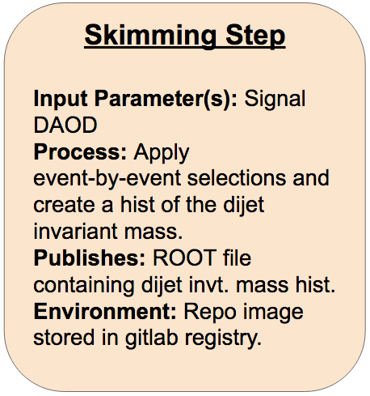

## Let's apply it to our code!

We now have all the yadage tools to put together our VHbb RECAST workflow, starting by "yadage-ifying" our first analysis step using the syntax we just learned. We can use essentially the same yadage structure and syntax for defining our analysis steps as we did for the message writing and shouting steps.

### Skimming Step



On gitlab, create a new repo to contain your workflow. Name it something like `danika-workflow` (but with your name instead of mine). Clone your new repo onto your computer.

**In another shell**, cd into the workflow repo and start the yadage container so you can validate and test the steps and workflow as you develop. You'll also need to log in to the gitlab docker registry using your CERN credentials so yadage can automatically pull images from the gitlab registry:

~~~bash
cd [your workflow repo]
docker run --rm -it -e PACKTIVITY_WITHIN_DOCKER=true -v $PWD:$PWD -w $PWD -v /var/run/docker.sock:/var/run/docker.sock yadage/yadage sh
docker login gitlab-registry.cern.ch
~~~

**Back in your first shell**, cd into your new workflow repo, and create your empty steps.yml and workflow.yml files. Next, create a directory called `inputdata`, copy your signal DAOD file into `inputdata`:

~~~bash
cd [your workflow repo]
touch steps.yml
touch workflow.yml
mkdir inputdata
cp /path/to/DAOD_EXOT27.20140688._000071.pool.root.1 inputdata/.
~~~

> ## Exercise (10 min)
>
> #### Part 1:
> Fill in the FIXMEs in the following skeleton code to encode the first skimming step of the analysis in your steps.yml file.
> ~~~yaml
> skimming:
>  process:
>    process_type: interpolated-script-cmd
>    script: |
>      # Source the ATLAS environment
>      [FIXME]
>      # Run the AnalysisPayload executable to produce the output ROOT file, looping over **all** events.
>      [FIXME: source setup script to run executables]
>      [FIXME] {input_file} {output_file}
>  environment:
>    environment_type: docker-encapsulated
>    image: [FIXME (use your gitlab registry image!)]
>    imagetag: master
>  publisher:
>    publisher_type: interpolated-pub
>    publish:
>      selected_events: [FIXME]
> ~~~
>
> #### Part 2:
> Fill in the following skeleton code to encode the corresponding workflow stage in your workflow.yml file.
> ~~~yaml
> stages:
> - name: skimming_step
>   dependencies: [FIXME]
>   scheduler:
>     scheduler_type: singlestep-stage
>     parameters:
>       input_file: {[FIXME], output: signal_daod}
>       [FIXME]: '{workdir}/selected.root'
>     step: [FIXME]
> ~~~
> > ## Solution
> > #### Part 1
> > ~~~yaml
> > skimming:
> >   process:
> >     process_type: interpolated-script-cmd
> >     script: |
> >       # Source the ATLAS environment
> >       source /home/atlas/release_setup.sh
> >       # Run the AnalysisPayload executable to produce the output ROOT file, looping over **all** events.
> >       source /Tutorial/build/x86_64-centos7-gcc8-opt/setup.sh
> >       AnalysisPayload {input_file} {output_file}
> >   environment:
> >     environment_type: docker-encapsulated
> >     image: gitlab-registry.cern.ch/[your_username (FILL IN!!!!)]/event-selection
> >     imagetag: master
> >   publisher:
> >     publisher_type: interpolated-pub
> >     publish:
> >       selected_events: '{output_file}'
> > ~~~
> > #### Part 2
> > ~~~yaml
> > stages:
> > - name: skimming_step
> >   dependencies: [init]
> >   scheduler:
> >     scheduler_type: singlestep-stage
> >     parameters:
> >       input_file: {step: init, output: signal_daod}
> >       output_file: '{workdir}/selected.root'
> >     step: {$ref: steps.yml#/skimming}
> > ~~~
> {: .solution}
{: .challenge}

While you are developing this, you can use the `packtivity-validate` command in your yadage container to quickly check if your step definition is valid:

~~~bash
packtivity-validate steps.yml#/skimming
~~~

And you can also test this step in your yadage container with a `packtivity-run` command like:

~~~bash
packtivity-run steps.yml#/skimming -p input_file="'{workdir}/inputdata/DAOD_EXOT27.20140688._000071.pool.root.1'" -p output_file="'{workdir}/selected.root'"
~~~

in this case the `{workdir}` is the current directory where you reside.


## Your First "Real" Workflow

Now that you have all the components in place and have validated your step with `packtivity-validate` and even run it with `packtivity-run`, we want to move to running a true workflow.  This will be done with the `yadage-run` command as:
~~~bash
yadage-run workdir workflow.yml -p signal_daod=DAOD_EXOT27.20140688._000071.pool.root.1 -d initdir=$PWD/inputdata
~~~
The generic structure of this command is :
```
yadage-run <working directory for run> <workflow.yml file> -p <init argument to set> -d <init directory to mount>
```
and it should be noted that there can be multiple instances of `-p` and `-d` flags and all of those individuals input arguments or mounted directories will be made available to the workflow.  In the case of this specific run we have :
  - `workdir` : The results from our workflow will be packaged up and all placed in a directory called `workdir`.  Within that directory, we will eventually find a `_yadage` directory and one directory for each of the packtivities, each of the individual and unique steps which are taken.  In this case, there will only be one, called `skimming_step` as defined in the workflow.
  - `workflow.yml` : This is the file that defined our sequence of steps that are to be taken.
  - `-p signal_daod=recast_daod.root` : We are defining the `signal_daod` parameter at the first stage of our workflow.  This parameter will be an "output" of the `[init]` stage of the workflow and can be picked up by any step from here.
  - `-d initdir=$PWD/inputdata` : Since we have a signal DAOD file for yadage to process, we'll need a way to tell the yadage-run command where to look for the DOAD file. This functionality is provided by the `-d initdir=` option.

Now let's also note that unlike the `packtivity-run` command that we did earlier, there is no `-p output_file='{workdir}/selected.root'` argument.  That is because in our `workflow.yml` file, that has been "hardcoded" in a sense.  "Isn't that bad?" you say. "No", I say, "That file will be produced internally used internally to our full analysis workflow, so no matter what specific MC sample we are running on, it need not change."  Again, we are embracing the concept of "parameterizing" our work and in this case really reflecting on which parameterizations matter, and which are superfluous and can really be hardcoded for *better*, not worse.

The output file, the thing whose name we have hardcoded (not parameterized) should be located under `workdir/skimming_step/selected.root` after a successful `yadage-run`.



