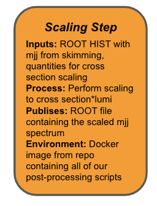

## Scaling our Spectrum

The next step, before we can do a statistical interpretation, is to make our results from the event selection portion of the analysis more physically meaningful. The raw MC histogram that we've produced so far with the AnalysisPayload code (`h_mjj`) is completely unscaled, meaning that it just bins the MC-weighted events that pass the kinematic selection. But in order to compare this histogram with those of the SM backgrounds and data from the detector we need to scale that histogram by the scale factor

**ScaleFactor = (sum of event weights)-1 x (filter efficiency) x (k-factor) x (cross section) x (luminosity)**

to properly account for how we expect the sum of **MC weighted** events produced by the signal process to scale relative to the SM background processes, and then to scale the number of events in all processes such that the total number of SM background events represents the total we expect to see in the data.

In terms of the workflow, we can already conceptually identify the *parameters* of this step of the workflow.  In total, this step is going to each the `h_mjj` histogram along with these five numerical quantities : `sum of event weights`, `filter efficiency`, `k-factor`, `cross section`, and `luminosity`.  We'll briefly review each of these factors and then extend our workflow to include this next step.

### Sum-of-Weights Normalization

The number of MC-weighted events that were used to generate an MC sample isn't actually at all relevant for comparing its size with other MC samples. This number just dictates the "statistics" of the sample (i.e. the amount of fluctuation in each bin due to the randomness of the MC generation). So this information must be "normalized out" by dividing the histogram by the **sum of event weights for all events produced in by the generator**.  Be careful, this number is not just the number of entries in the DAOD tree with which you are working!

> ## Exercise (15 min)
> Obtain the sum of event weights produced by the generator for later use in normalizing the histogram for the signal you are using.  There are many ways to do this, but indeed there is a "recommended" way to do this from the friendly folks in AMG.
>
> > ## Solution
> >The sum of MC event weights can be obtained from the `CutBookkeepers` container - the [The AthAnalysisBase Handbook](https://twiki.cern.ch/twiki/bin/view/AtlasProtected/AthAnalysisBase#How_to_access_EventBookkeeper_in) includes code for doing so either in [pure ROOT](https://twiki.cern.ch/twiki/bin/view/AtlasProtected/AthAnalysisBase#How_to_access_EventBookkeeper_in) or [pyROOT](https://twiki.cern.ch/twiki/bin/view/AtlasProtected/AthAnalysisBase#How_to_print_the_sum_of_weights) - the result for our signal sample is **6813.025800**.
> >
> > This can be obtained by adapting the sample python script provided [here](https://twiki.cern.ch/twiki/bin/view/AtlasProtected/AthAnalysisBase#How_to_print_the_sum_of_weights) to access your DAOD file and obtain the associated sum of MC event weights at AOD level (remember to volume-mount the signal DAOD file along with the python script so the script can access this file in the container). Add this script to your local analysis repo (eg. in a directory named `python`), and push the update to gitlab.
> >
> > The only adaptation that should be needed in the python script is to replace `files = [os.environ['ASG_TEST_FILE_MC']]` (line 4) with the path to your DAOD, eg. `files = "/Data/DAOD_EXOT27.17882744._000026.pool.root.1"`. Then, you could run the script as follows, starting from the top level of your analysis repo (assuming the script is in `python/ GetSumOfWeights.py` and the DAOD is in `Data/llbb_VpT/DAOD_EXOT27.17882744._000026.pool.root.1`):
> > ~~~bash
> > docker run --rm -it -v $PWD/Data/llbb_VpT:/Data -v $PWD/python:/python atlas/analysisbase:21.2.85-centos7 bash
> > python /python/GetSumOfWeights.py
> > ~~~
> > The output should look something like:
> > ~~~
> > xAOD::Init                INFO    Environment initialised for data access
> > TClass::BuildRealData     ERROR   Inspection for allocator<double> not supported!
> > TStreamerInfo::Build      WARNING _Vector_base<double,allocator<double> >: _Vector_base<double,allocator<double> >::_Vector_impl has no streamer or dictionary, data member "_M_impl" will not be saved
> > TStreamerInfo::Build      WARNING allocator<double>: base class __gnu_cxx::new_allocator<double> has no streamer or dictionary it will not be saved
> > TStreamerInfo::Build      WARNING _Vector_base<double,allocator<double> >::_Vector_impl: base class allocator<double> has no streamer or dictionary it will not be saved
> > TStreamerInfo::Build      ERROR   _Vector_base<double,allocator<double> >::_Vector_impl, discarding: double* _M_start, no [dimension]
> > TStreamerInfo::Build      ERROR   _Vector_base<double,allocator<double> >::_Vector_impl, discarding: double* _M_finish, no [dimension]
> > TStreamerInfo::Build      ERROR   _Vector_base<double,allocator<double> >::_Vector_impl, discarding: double* _M_end_of_storage, no [dimension]
> > xAOD::MakeTransientMet... INFO    Created transient metadata tree "MetaData" in ROOT's common memory
> > Sum of Weights = 6813.025800
> > xAOD::TFileAccessTracer   INFO    Sending file access statistics to http://rucio-lb-prod.cern.ch:18762/traces/
> > ~~~
> > {: .output}
> {: .solution}
{: .challenge}

> ## The JZW Samples
> A perennial issue that trips many people up, and which
{: .callout}

### Cross Section

If the MC generator indiscriminately produced the full range of events for a given process, this would just require scaling the histogram for each MC sample by the predicted production cross section &sigma; after dividing by the sum of event weights.

### Filter Efficiency
In practice though, generators will sometimes apply filters during event generation to focus on producing events that will be of interest for physics analyses. In this case, the generator needs to provide a "filter efficiency" (equal to 1 if there are no such selections before generation) that represents the expected fraction of events that make it past these filters and into the MC samples.

### k-factor

Sometimes, generators will also provide a "k-factor" (set to 1 by default), which becomes relevant when there's an expectation that higher-order terms in the process - beyond what the generator produces - will contribute non-negligibly to the cross section. The k-factor tries to correct for the absence of these higher-order terms.

> ## Exercise (15 min)
> Obtain the cross section, filter efficiency, and k-factor for our signal sample.
>
> > ## Solution
> > **cross section:** The AMI webpage and pyAMI interface actually give two different values: 76.107 fb (AMI) and 44.837 fb (getMetaData.py)! We asked the susy bg forum conveners about this, and they explained that the value of 76.107 fb doesn't take the H to bb branching ratio (BR) of ~0.58 into account, whereas the 44.837 fb from getMetaData.py does account for this BR, so best to go with the **44.837 fb** from getMetaData.py.  This is all to say that the numbers you use here should not be blindly applied.  Be critical, like any good scientist.  If the fact that they are different infuriates you, then consider going to work in AMG.  Your efforts there can help alleviate such peculiarities such as this and benefit the entire collaboration.
> >
> > **filter efficiency:** 1.0
> >
> > **k-factor:** 1.0
> > To complete this exercise, you'll need to have a valid grid certificate on your browser, have registered it with VOMS,
> > and uploaded to your home directory on lxplus (see details in [Setup section](https://danikam.github.io/2019-08-19-usatlas-recast-tutorial/setup.html)).
> >
> > #### Method 1: AMI Website
> > First, we'll try getting the information from the AMI website.
> > * Go to [https://ami.in2p3.fr](https://ami.in2p3.fr), then click on "Dataset Browser for AMI V2".
> >
> > * Press the `mc16` button corresponding to the type of data we have, then you'll arrive at a page with a column of buttons on the left-hand side that you can use to refine your search and find the exact dataset we've been using.
> >
> > * Since we already know the full name of our dataset, the most efficient search option on the AMI page is probably the "LDN" button, which stands for "Logical Dataset Name". There, you can provide the full name of the dataset, and it should come up with only 1 option.
> >
> > * Once you've narrowed down the search to the dataset, click on the green "View Selection" button in the top left, and this will bring up a DATASET tab with details about the selected dataset. Here, you can scroll to the right to view columns with all sorts of information about the dataset, including the cross section (CROSSSECTION) and
> > generator filter efficiency (GENFILTEFF).
> >
> > **k-factors** : You may notice that the "k-factor" is not listed here.  And that is fine. The k-factor, short for **knowledge**-factor,
> > and something that is conventionally representative of the multiplicative scale factor that transforms an inclusive
> > cross section from leading order (LO) to next to leading order (NLO) is something that is typically handled "offline"
> > in ATLAS and is often-times group specific.  For the purposes here, we will just be using the cross section that *is*
> > available in AMI.  However, when you jump into a real analysis, be sure to understand whether the numbers stored in
> > AMI are really the ones you "should" be using or whether you need to use some k-factors.
> >
> > #### Method 2: pyAMI
> > The above method of getting the cross section and filter efficiency from the AMI website worked ok for one dataset,
> > but it took some time to click around and wait for stuff to load - which we probably wouldn't want to
> > repeat again and again if we wanted to get this info for all our backgrounds - and it also didn't give us the
> > k-factor. If you're only really interested in these three pieces of information, and don't actually need all
> > the extra info that the website brings along for the ride, the python AMI interface [pyAMI](https://ami.in2p3.fr/pyAMI/)
> > includes a handy script called [getMetadata.py](https://twiki.cern.ch/twiki/bin/viewauth/AtlasProtected/AnalysisMetadata)
> > that quickly accesses these three values for any number of input datasets.
> >
> > ssh onto lxplus and, following the instructions in the twiki page linked above for `getMetadata.py` (https://twiki.cern.ch/twiki/bin/viewauth/AtlasProtected/AnalysisMetadata), obtain the cross section, filter efficiency, and k-factor for our signal file.
> {: .solution}
{: .challenge}

### Luminosity

The last step is to scale everything by the integrated luminosity of the collision data so that the scaled sum of weighted events in our MC represents the number of events from the signal process that we would expect to see in our data.  For this tutorial, we'll scale to the full run 2 luminosity of **140.1 fb-1**.

## Building our Scaling Step

To extend our workflow and include the scaling step, we are going to need to add a new "generic" step to our `steps.yml` file, and then dictate more precisely *how* we want to use this within our `workflow.yml` in the grand scheme of things.  In particular, we are going to want to know how we can make this next step "talk" to the first step and pick up that output file containing the `h_mjj` histogram from the `skimming_step` from before.

### `steps.yml`
Please add the following to your steps.yml file to encode this final step.  As you can see, this step has quite a number of parameters that it will want to eat, and it will be spitting out to us two "output" parameters, `output_plot` and `output_file`, which contain a visualization of the scaling of `h_mjj` (so we can look at something to validate the behavior of this step) and a file containing the scaled histogram that we will eventually want to use in our statistical analysis.

~~~yaml
scaling:
 process:
   process_type: interpolated-script-cmd
   script: |
     source /home/atlas/release_setup.sh
     cd /code
     python scale_to_lumi_xsec.py -i {input_file} \
                                  -o {output_file} \
                                  -p {validation_plot} \
                                  -c {cross_section} \
                                  -s {sum_of_weights} \
                                  -k {k_factor} \
                                  -f {filter_eff} \
                                  -l {luminosity} \
                                  -g {hist}
 environment:
   environment_type: docker-encapsulated
   image: gitlab-registry.cern.ch/recast-examples/post-processing
   imagetag: master
 publisher:
   publisher_type: interpolated-pub
   publish:
     output_plot: '{validation_plot}'
     output_file: '{output_file}'
~~~

### `workflow.yml`
Now let's focus on how to get this atomic step implemented in our specific workflow of interest in the `workflow.yml` file. Copy the lines below to create a new step in `workflow.yml`, just below your `skimming_step`.

~~~yaml
- name: scaling_step
  dependencies: [init,skimming_step]
  scheduler:
    scheduler_type: singlestep-stage
    parameters:
      input_file:      {step: skimming_step, output: output}
      output_file:     '{workdir}/output_scaled.root'
      validation_plot: '{workdir}/output_scaled.pdf'
      cross_section:   {step: init, output: cross_section}
      sum_of_weights:  {step: init, output: sum_of_weights}
      k_factor:        {step: init, output: k_factor}
      filter_eff:      {step: init, output: filter_eff}
      luminosity:      {step: init, output: luminosity}
      hist:            {step: init, output: hist}
    step: {$ref: steps.yml#/scaling}
~~~

Let's compare it to that step to see what we can learn.
  - We have extended the list of `dependencies`.  In addition to being able to pick up input parameters from the command line (`-p` arguments to `yadage-run`) we will also be able to pull parameters that *output* from `skimming_step`.  This is necessary to be able to receive that file containing `h_mjj`.
  - The `input_file` parameter reflects this by pulling the parameter `output` (one of the things that got published in `skimming_step`) from that previous step - `{step: skimming_step, output: output}`.
  - We are using a json reference to point to the `scaling` step - `{$ref: steps.yml#/scaling}`

Beyond this, the other parameters should look familiar, and you will appreciate that we are going to need to provide a number of more parameters.  You will also recognize that we have intentionally hardcoded two of the parameter names, namely those which will only be used internally to the workflow and be published as output from this step to be picked up by the statistical analysis step of the analysis.

## Running our Two Step Workflow
Let's begin by running *only* this single `scaling_step` to make sure it works before trying to see about linking the two steps together. Make sure that you are residing in the same directory from which you ran the one stage workflow before.  You should see the `workdir` directory from this previous run which contains the `skimming_step/selected.root` published output from that run.  We are going to pick that up as input here by running the following `packtivity_run` command which also incorporates all the scaling factors we've obtained.

~~~bash
packtivity-run steps.yml#/scaling  -p input_file="'{workdir}/selected.root'" -p output_file="'{workdir}/signal_scaled.root'" -p validation_plot="'{workdir}/signal_scaled.png'" -p cross_section=44.873 -p sum_of_weights=6813.025800 -p k_factor=1 -p filter_eff=1 -p luminosity=140.1 -p hist='h_mjj'
~~~

If that ran successfully, then you should see the `hist.png` and `limit.png` file be produced.  Great! So that step works and we want to link them both together and execute the full workflow with `yadage-run`. However, with so many input parameters at this point, it can get a bit cumbersome to keep listing them on the command line - yadage has a solution for this! Create a new file called `inputs.yml` at the top level of your workflow directory, and fill it with the following:

~~~yaml
signal_daod: DAOD_EXOT27.20140688._000071.pool.root.1
xsection: 44.837
sumweights: 6813.025800
kfactor: 1.0
filterfactor: 1.0
luminosity: 140.1
~~~

The full yadage-run command can now be run as follows, with an optional third argument giving the name of the file with the input parameters:

~~~bash
yadage-run workdir workflow.yml inputs.yml -d initdir=$PWD/inputdata
~~~

> ## Cleanup
> Remember to cleanup your `workdir` before launching this run.  Otherwise, yadage will crash quite quickly and not proceed.  It will tell you this.
{: .callout}



