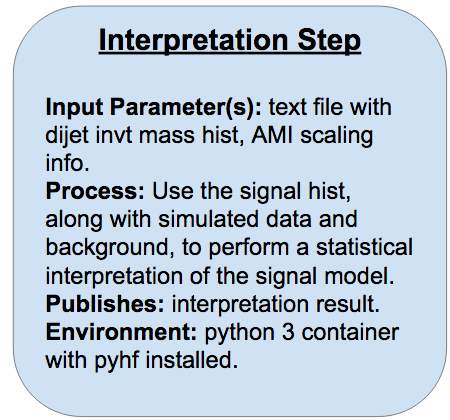
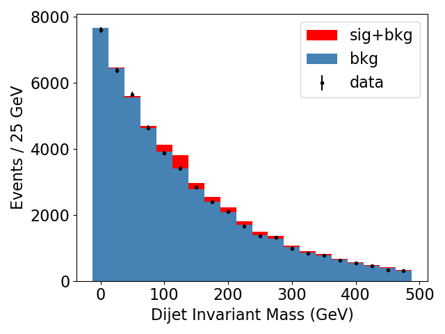
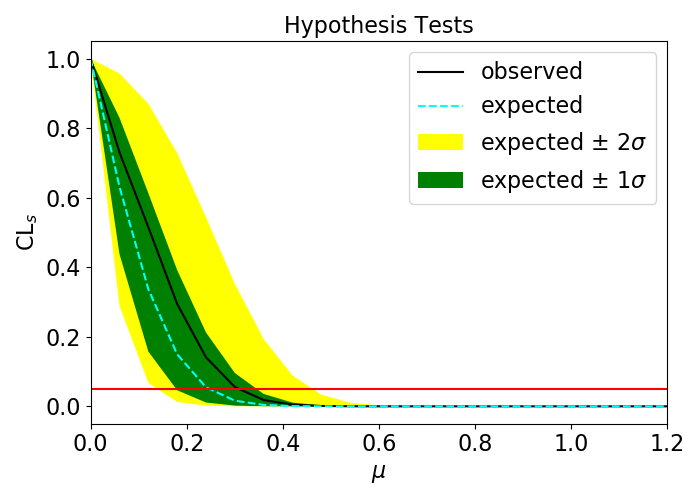

## Understanding the (Re)interpretation step

The final step of our VHbb analysis chain, originally developed by Lukas Heinrich, receives five inputs (four of which are for the MC scaling discussed in the last episode):

* `h_mjj` histogram
* sum of MC generator event weights
* predicted signal cross-section
* filter efficiency
* k-factor

For our interpretation, mock background MC is generated from a falling exponential distribution and we bin it with the same edges as the input signal histogram. A toy data histogram is then generated by randomly selecting the number of events in each bin from a Poisson distribution with mean &lambda; equal to the amplitude of the equivalent background MC bin.  We won't go through the details of how this is coded during this tutorial - we provide the full image for this last step (but feel free to look through the [gitlab repo](https://gitlab.cern.ch/usatlas-computing-bootcamp/pyhf-fit) that produces it later on if you're curious). But if you're keen to try doing the toy MC and data generation yourself, check out the next (optional) bonus exercise. 

Here is a sample plot of the mock background, signal, and toy data produced by this step:

 

> ## Exclusion vs. Discovery
> You'll notice that we haven't incorporated the signal model into our toy data generation at all, so at present we don't actually expect to find any evidence for our signal in the data. We could choose to add in some signal component and see at what point we can detect the signal, but for this tutorial we chose to keep the data consistent with background because (sadly...) given the lack of excesses we've seen so far with beyond-standard-model (BSM) searches at the LHC analysts doing these BSM searches are so far dealing with "exclusion" scenarios, where the data is found to be consistent with background, and the next step is to place an upper bound on the cross section, above which the analysis results exclude the existence of the signal to some degree of confidence (typically 95%). Please feel free to play around with the data generation and pyhf fit on your own later though and try out a discovery scenario!
{: .callout}

> ## Bonus Exercise!
> Use your language of choice to write a program which:
> 
>   a) Inputs the signal histogram we produced as a root file in the skimming step
> 
>   b) Generates 50000 MC background samples from an exponential distribution in dijet invariant mass with a decay constant of 150
> 
>   c) Bins the generated MC background samples according to the binning of the signal histogram, and 
> 
>   d) Generates a toy data histogram, where the number of events in each bin is randomly generated from a Poisson distribution with central value &lambda; equal to the amplitude of the MC background in the same bin.
> > ## Solution
> > For the solution implemented in python for this interpretation step, see lines [43-64 of run_fit.py](https://gitlab.cern.ch/damacdon/bootcamp-pyhf-fit/blob/standalone/run_fit.py#L43-64)
> {: .solution}
{: .challenge}

Finally, the signal, mock background, and toy data are passed through the pyhf interpretation to produce something called a &mu;-scan. The x axis is the hypothetical "signal strength" of a model where you hypothesize that the data is composed of:

data = &mu;s + b

where s is the signal component and b is the background. The y-axis shows the CLs, which is defined as the ratio of the p-value CLs+b associated with comparing the data to the &mu;s + b hypothesis to the p-value CLb associated with the background-only hypothesis:

CLs = CLs+b / CLb

The following figure shows a sample &mu;-scan produced by this step, where the observed CLs variation is in this case within the expected bounds for a background-only hypothesis. Values of the signal strength &mu; above which the observed CLs falls below the horizontal red line at CLs=0.05 are excluded by the fit. Below these values, the statistics  are too poor to confidently exclude these signal strengths.

 

## Encoding the Interpretation Step

Please add the following to your steps.yml file to encode this final step:

~~~yaml
interpretation_step:
  process:
    process_type: interpolated-script-cmd
    script: |
     python /code/run_fit.py \
            --inputfile {signal} \
            --xsection {xsection} \
            --sumofweights {sumweights} \
            --kfactor {kfactor} \
            --filterfactor {filterfactor} \
            --luminosity {luminosity} \
            --plotfile {plot_png} \
            --outputfile {fit_result}
  environment:
    environment_type: docker-encapsulated
    image: gitlab-registry.cern.ch/damacdon/bootcamp-pyhf-fit
    imagetag: standalone
  publisher:
    publisher_type: interpolated-pub
    publish:
      inference_result: '{fit_result}'
      visualization: '{plot_png}'
~~~

and the corresponding workflow step to your workflow.yml:

~~~yaml
- name: interpretation_step
  dependencies: [skimming_step]
  scheduler:
    scheduler_type: singlestep-stage
    parameters:
      signal: {step: skimming_step, output: selected_events}
      xsection: {step: init, output: xsection}
      sumweights: {step: init, output: sumweights}
      kfactor: {step: init, output: kfactor}
      filterfactor: {step: init, output: filterfactor}
      luminosity: {step: init, output: luminosity}
      fit_result: '{workdir}/limit.png'
      plot_png: '{workdir}/hists.png'
    step: {$ref: steps.yml#/interpretation_step}
~~~

This step can be tested with the following `packtivity_run` command which incorporates all the scaling factors we've obtained:

~~~bash
packtivity-run -p signal="'{workdir}/workdir/skimming_step/selected.root'" -p xsection=44.837 -p sumweights=6813.025800 -p kfactor=1.0 -p filterfactor=1.0 -p luminosity=140.1 -p plot_png="'{workdir}/hists.png'" -p fit_result="'{workdir}/limit.png'" steps.yml#/interpretation_step
~~~

With so many input parameters at this point, it gets a bit cumbersome to keep listing them on the command line - yadage has a solution for this! Create a new file called `inputs.yml` at the top level of your workflow directory, and fill it with the following:

~~~yaml
signal_daod: recast_daod.root
xsection: 44.837
sumweights: 6813.025800
kfactor: 1.0
filterfactor: 1.0
luminosity: 140.1
~~~

The full yadage-run command can now be run as follows, with an optional third argument giving the name of the file with the input parameters:

~~~bash
yadage-run workdir workflow.yml inputs.yml -d initdir=$PWD/inputdata
~~~



