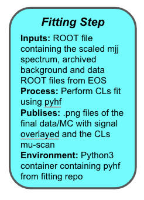
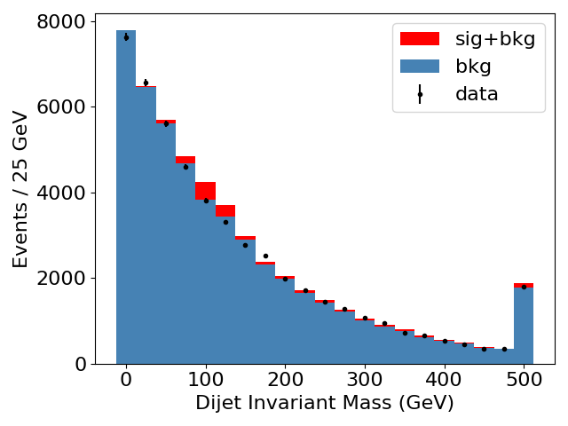
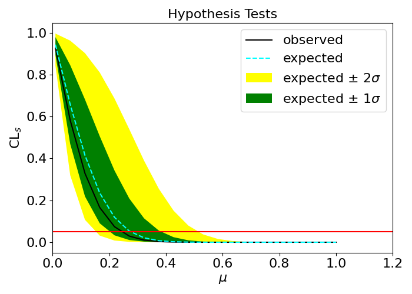

## Understanding the (Re)interpretation step

The interpretation step will receive the `h_mjj` histogram, which has now been scaled to a physically meaningful cross section by the `scaling_step`, and perform the statistical comparison with some simulated background and data. The fitting will be done with [pyhf](https://diana-hep.org/pyhf/), a specialized fitting module designed for HEP applications and written in pure python (i.e. no ROOT dependencies). We won't dig into the actual details of the `pyhf` implementation during this tutorial and in fact, you shouldn't have to look at the implementation, but rather just use the interface described in the previous step.

The final step of our VHbb analysis chain receives three "physics inputs" :
  - **Signal Histogram** : This is going to come from the previous `scaling_step` of the analysis since that will have to be done each time we want to pass a new signal through this workflow. So we will need to do some linking of that step with this new step.
  - **Data Histogram** : This is externally saved data and we will need to pull that in from the archive where it is preserved. We'll be using EOS for this archive.
  - **Background Histogram** : Same as the data, we will need to pull that in from the archive where it is preserved on EOS.

What should come out the other side are the two "money plots" of the analysis re-interpretation :
  - **Data/MC** : The m(jj) spectrum with the background, data, and our new signal.  This is somewhat for validation but also essential to get a sense of what this new signal looks like compared to our old one.
  - **Limits** : The CLs-based "mu scan" for this one signal mass point from which we can obtain the numerical value of the limit on this specific signal. If you are unfamiliar with this, we recommend you read [1007.1727](https://arxiv.org/abs/1007.1727).

Spectrum of Data/MC        |  Reinterpreted Limit
:-------------------------:|:-------------------------:
   |  

> ## Exclusion vs. Discovery
> You'll notice that we aren't talking about a signal fit for discovery or cross section extraction.  We are talking about exclusion.  This is because **this instantiation** of RECAST is focused around a search where you have already done your unblinding and know there is no signal and wish to know what quantitatively different statement you can make about another signal.
>
> It is entirely possible to write a RECAST workflow to perform unfolding, or extraction of a cross section.  It is even possible to write workflows that combine together multiple analyses in the case that you are doing a grand statistical combination in something like the SUSY pMSSM scan or the Exotics Heavy Resonance Combination.  All of this is possible and utilities exist to facilitate it.
{: .callout}

## EOS Intermezzo for File Preservation
You should already be familiar with using EOS for archiving files to be used in your
CI jobs.  This was covered in the [HSF CICD tutorial in great detail](https://hsf-training.github.io/hsf-training-cicd/11-skim-milk/index.html).
You need to provide authenticating information via kerberos `kinit` and then you can access any EOS area to which you have been granted privileges.  The mechanism to do this in recast with yadage is described [here](https://recast-docs.web.cern.ch/recast-docs/workflowauthoring/steps/#authentication).

### In Real Life
This is the same mechanism by which your background and data are preserved for a fully recasted ATLAS analysis.  In fact, there is a dedicated storage area for such data for each individual analysis that will be created for you with the path like `/eos/project/r/recast/atlas/ANA-XXXX-20XX-XX`. All of these details, along with how to request this space, etc. are all described in the [recast-docs](https://recast-docs.web.cern.ch/recast-docs) and you are *highly* encouraged to read them thoroughly when moving to your actual analysis, even if this tutorial was a piece of cake.

### For this Toy Analysis
However, for this tutorial, we will be using a toy EOS area at this location - `root://eosuser.cern.ch//eos/user/j/jesjer/ATLASRecast2021`. At this location, there will be one file `external_data.root` which contains two histograms : `data` and `background`.  These are the inputs that your job will pull in for the test example.  This is a service account called `jesjer` (created by Sam, it's not some official JetEtMiss thing, don't worry, though it has some jet calibration stuff there) with a password that you can get from the organizers.

## Encoding the Interpretation Step

This time, the encoding of the steps are left as exercises to challenge yourself to meditate on what you have learned and tie it together before looking at the solution.  Really give it a concerted try knowing that you can always reveal the answer.

### `steps.yml`
Start by looking back at what needs to be called in order to execute the `run_fit.py` call in the initial description of our analysis utilities in the introduction of this entire workflow.  Think about the following:
  - What "preparatory steps" (like `asetup` if you were on CVMFS) need to be executed *before* you can execute `run_fit.py`?  This will include anything having to do with EOS.
  - What is the precise command that you need to run and which *parameters* will you need to feed it enclosed in `{}`?
  - Which docker image environment are you going to need for running this step?
  - Which outputs are you going to want to save to be able to examine afterwards?  Do you need to output anything to pass on to a further step? Can the names of these be hardcoded or must they be flexibly modified?

Now you are going to write a new step called `fitting` in your `steps.yml` file.

> ## Write It
> Within your `steps.yml` file, write the new `fitting` step. Start by using one of the existing steps as a template!
>
> > ## Solution
> >
> > ~~~yaml
> > fitting:
> >  process:
> >    process_type: interpolated-script-cmd
> >    script: |
> >      cat {eospass}
> >      cat {eosuser}
> >      echo "{eospass}" | kinit {eosuser}@CERN.CH
> >      xrdcp {filedata} {local_dir}/file_data.root
> >      xrdcp {filebkg}  {local_dir}/file_bkg.root
> >      cd /code
> >      python run_fit.py --filedata {local_dir}/file_data.root --histdata {histdata} --filebkg {local_dir}/file_bkg.root --histbkg {histbkg} --filesig {filesig} --histsig {histsig} --outputfile {outputfile} --plotfile {plotfile}
> >  environment:
> >    environment_type: docker-encapsulated
> >    image: gitlab-registry.cern.ch/recast-examples/fitting
> >    imagetag: master
> >  publisher:
> >    publisher_type: interpolated-pub
> >    publish:
> >      output_spectrum: '{plotfile}'
> >      output_limit:    '{outputfile}'
> > ~~~
> {: .solution}
>
{: .challenge}

### `workflow.yml`
At this point, you need not be concerned with the particular implementation of a given call to a script.  You are specifying how the parameters in your new step are going to get the parameters and what atomic step they are going to be fed to. Think about the following :
  - What steps must this `fitting_step` get inputs from? What does it depend on?
  - What parameters must it define and where are these coming from?  Are they coming from the `init` stage, or a previous step? Perhaps they can be safely hardcoded?
  - What actual `step` are you going to be parameterizing here? What step are you *referring* to?

Now you are going to write a new step called `fitting_step` in your `workflow.yml` file.

> ## Write It
> Within your `workflow.yml` file, write the new `fitting_step` stage. Start by using one of the existing stages as a template!
>
> > ## Solution
> >
> > ~~~yaml
> > - name: fitting_step
> >   dependencies: [init,scaling_step]
> >   scheduler:
> >     scheduler_type: singlestep-stage
> >     parameters:
> >       eosuser:     {step: init, output: eosuser}
> >       eospass:     {step: init, output: eospass}
> >       filedata:    {step: init, output: filedata}
> >       histdata:    {step: init, output: histdata}
> >       filebkg:     {step: init, output: filebkg}
> >       histbkg:     {step: init, output: histbkg}
> >       filesig:     {step: scaling_step, output: output_file}
> >       histsig:     {step: init, output: hist}
> >       outputfile:  '{workdir}/limit.png'
> >       plotfile:    '{workdir}/spectrum.png'
> >       local_dir:   '{workdir}'
> >     step: {$ref: steps.yml#/fitting}
> > ~~~
> {: .solution}
>
{: .challenge}

This step can be tested with the following `packtivity_run` command which incorporates all the scaling factors we've obtained:

~~~bash
packtivity-run -p signal="'{workdir}/workdir/skimming_step/selected.root'" -p xsection=44.837 -p sumweights=6813.025800 -p kfactor=1.0 -p filterfactor=1.0 -p luminosity=140.1 -p plot_png="'{workdir}/hists.png'" -p fit_result="'{workdir}/limit.png'" steps.yml#/interpretation_step
~~~

## Run It

Running this three-step workflow is rather straightforward by extending the `inputs.yml` file to insert the necessary additional parameters for this last stage of the workflow.  You should begin to think of this file as the very high level set of switches that control the global behavior of your entire analysis.  Every once in a while it's good to review whether all of the parameters in here are truly necessary or whether some are purely internal.

~~~yaml
initdir: '$PWD/inputdata'
signal_daod: 'DAOD_EXOT27.20140688._000071.pool.root.1'
cross_section: 44.873
sum_of_weights: 6813.025800
k_factor: 1
filter_eff: 1
luminosity: 140.1
hist: 'h_mjj'
eosuser: 'jesjer'
eospass: 'Fare-Sawa'
filedata: 'root://eosuser.cern.ch//eos/user/j/jesjer/ATLASRecast2021/external_data.root'
histdata: 'data'
filebkg: 'root://eosuser.cern.ch//eos/user/j/jesjer/ATLASRecast2021/external_data.root'
histbkg: 'background'
~~~

The full yadage-run command can now be run as follows, with an optional third argument which gives the name of the file with the input parameters:

~~~bash
yadage-run workdir workflow.yml inputs.yml -d initdir=$PWD/inputdata
~~~



