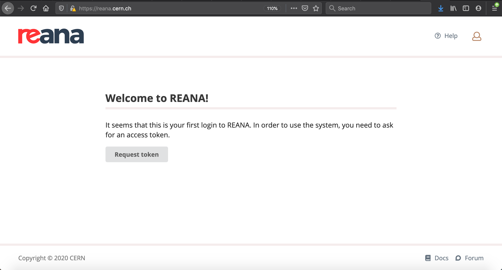
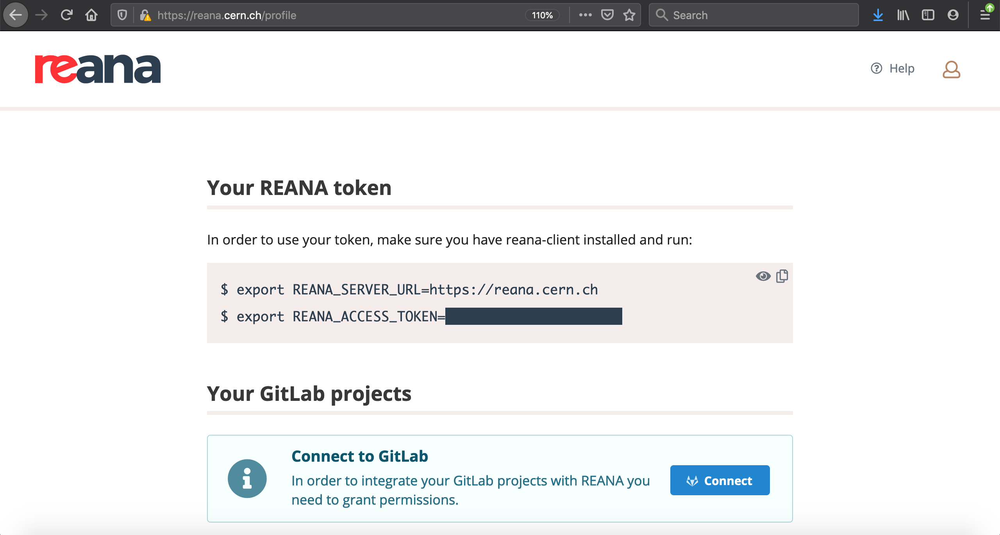

## Full steam ahead
For a real analysis, it should be pretty doable to develop your RECAST workflow on your own PC running docker by running with reduced input statistics and only dealing with one signal sample at a time. But what happens when we want to see what our baby can do with full signal statistics, maybe over a whole grid of signal samples? Your PC may sputter at the CPU and RAM requirements of a full-stats analysis workflow, and lxplus doesn't even have a docker installation, so it's not much help either. This is where REANA enters the scene.

## What is REANA anyway?

[REANA](https://reanahub.io/) is pilot project for executing containerized workflows which originated in HEP. It supports multiple workflow description languages (CWL, yadage and serial), and can run on multiple computing backends ([Kubernetes](https://kubernetes.io/), [HTCondor](https://research.cs.wisc.edu/htcondor/) and [Slurm](https://slurm.schedmd.com/documentation.html)). REANA embraces the declarative approch to workflow specification, maening that the user is only expected to know **what** they want the workflow to do (eg. by writing the workflow spec files that we've already developed for our RECAST workflow), without needing to be aware of any 'behind the scenes' details like how resources get allocated to run the workflow, or where intermediate data files get stored.

The REANA instance at CERN runs on a Kubernetes cluster, and is specifically intended to handle:
  * Large input files
  * Long run times
  * Highly parallel workflows
  
The best part is that REANA is currently being maintained and continually improved by an active and energetic development team based at CERN, and the developers are enthusiastically open to user feedback and questions ([link to join REANA channel in CERN IT](https://mattermost.web.cern.ch/it-dep/channels/reana)).

Alright, well enough chit-chat - let's get down to business and try running our workflow on REANA. 

## Great, so how do I run my workflow on REANA?

REANA uses its own client, `reana-client`, to submit and execute containerized workflows on the REANA cluster. There are a few steps needed to transition your workflow to run on REANA, which are outlined [here](https://recast-docs.web.cern.ch/recast-docs/using/#running-recast-on-reana) in the RECAST docs. There are ongoing efforts behind the scenes to make this transition more automated, so with any luck these instructions will become obsolete in the not-too-distant future. 

### Get a token

To use the REANA cluster running at CERN (the one with all the resources for big input files and long run times and all that), you'll need to request an access token if you don't yet have one. In case you don't have a token yet, you'll be prompted to request one the first time you open the user interface for the cluster in your browser. Go to [reana.cern.ch](https://reana.cern.ch) in your browser. If you're not running on the CERN network, you'll first need to tunnel into it as follows before your browser will load the page:

```bash
sshuttle --dns -v --remote [your_cern_username]@lxplus.cern.ch 0.0.0.0/0
```
If after logging in with your personal CERN credentials you see a page like this:



then click on the `Request token` button and you should be hooked up with a shiny new access token within a CERN working day or so. Once you have a token, you can go to your profile at [reana.cern.ch/profile](https://reana.cern.ch/profile) to access the bash commands needed to set the environment variables `REANA_SERVER_URL` and `REANA_ACCESS_TOKEN` that the `reana-client` uses to access the CERN REANA cluster:



### Make a new branch

Currently some of the changes needed to run the RECAST workflow on REANA are incompatible with running it using the `recast-atlas` client. To preserve the original version of the specs that's compatible with the `recast-atlas` client, we'll make our updates on a new branch called `reana`.

```bash
# Make new branch reana
git checkout -b reana

# Push the new branch to the gitlab repo
git push -u origin reana
```

### Update json references in `workflow.yml`

The `recast-atlas` client assumes that the `specs.yml` file will be located inside the `specs` directory. But REANA is a bit less presumptuous, and needs to be explicitly told to look for it inside `specs` by updating the json references to `steps.yml` in the `workflow.yml` from `steps.yml#/example_step` to `specs/steps.yml#/example_step`. We're also going to remove the first skimming step `skimming_step` that reads in the input file locally, since REANA is better suited for downloading the workflow input data. The updated `workflow.yml` should look like:

```yaml
stages:
- name: skimming_step_eos
  dependencies: [init]
  scheduler:
    [...]
    step: {$ref: specs/steps.yml#/skimming_eos}


- name: scaling_step
  dependencies: [init,skimming_step_eos]
  scheduler:
    [...]
    step: {$ref: specs/steps.yml#/scaling}


- name: fitting_step
  dependencies: [init,scaling_step]
  scheduler:
    [...]
    step: {$ref: specs/steps.yml#/fitting}
```

### Yet another authentication method

REANA has its own approach to setting up the kerberos authentication. Rather than mounting the credentials into the container and running `kinit` with them, REANA instead requires you to upload your credentials to the cluster, and stores them there as "secrets". We'll follow the [instructions in the REANA docs](http://docs.reana.io/advanced-usage/access-control/kerberos/) to generate a `.keytab` file on lxplus which contains or CERN credentials, then upload this file to the REANA cluster as a secret. 

```bash

# ssh onto lxplus
ssh [your_cern_username]@lxplus.cern.ch

# Set up the environment variables needed for reana-client to access the CERN REANA cluster
export REANA_SERVER_URL=https://reana.cern.ch
export REANA_ACCESS_TOKEN=[fill_in_your_personal_reana_token]

# Source an activation script which allows us to run the reana-client
source /afs/cern.ch/user/r/reana/public/reana/bin/activate

# Run the ktutil commands to generate a .keytab file with the auth credentials for the recasttu account
# Password to enter for recasttu account is: DidiBuki1
ktutil
add_entry -password -p recasttu@CERN.CH -k 1 -e aes256-cts-hmac-sha1-96
add_entry -password -p recasttu@CERN.CH -k 1 -e arcfour-hmac
write_kt .keytab
exit

# Upload the .keytab file to your personal user account on REANA
reana-client secrets-add --env CERN_USER=[your_cern_username] \
                         --env CERN_KEYTAB=.keytab \
                         --file .keytab

# Exit our of lxplus
exit
```

Since we're no longer sourcing the script `/recast_auth/getkrb.sh` that was previously being generated automatically by the `recast-atlas` client for authentication, we can remove the line `. /recast_auth/getkrb.sh` from any steps that use kerberos auth. For example, the first step will now look like:

```yaml
skimming_eos:
process:
  process_type: interpolated-script-cmd
  script: |
    source /home/atlas/release_setup.sh
    xrdcp {input_file} {local_dir}/input.root
    source /Tutorial/build/x86_64-centos7-gcc8-opt/setup.sh
    AnalysisPayload {local_dir}/input.root {output_file} 1000
    rm {local_dir}/input.root
environment:
  environment_type: docker-encapsulated
  image: gitlab-registry.cern.ch/recast-examples/event-selection
  imagetag: final
  resources:
    - GRIDProxy
publisher:
  publisher_type: interpolated-pub
  publish:
    output: '{output_file}'
```

### Update resources in `steps.yml`

REANA uses a resource called `kerberos: true` rather than the `GRIDProxy` used by the `recast-client` to indicate if a step will need to use the kerboros credentials we just set up in the previous step. Also, for any analysis images that use a non-root user (like the `atlas` user used in the `atlas/analysisbase` image), REANA needs to be explicitly told the user ID (UID) of the user so it can give that user permission to read from and write to storage on the cluster. This is done with the resource `kubernetes_uid: XXX`. For `atlas/analysisbase` tags prior to `21.2.88`, the uid was 500, after which it was changed to 1000. So for stages using images built from the [event-selection](https://gitlab.cern.ch/recast-examples/event-selection) or [post-processing](https://gitlab.cern.ch/recast-examples/post-processing) code, which [use `atlas/analysisbase:21.2.85-centos7` as their base image](https://gitlab.cern.ch/recast-examples/event-selection/-/blob/final/Dockerfile#L2), we'll need to add a resource `kubernetes_uid: 500`. With these updates, your `steps.yml` file should now look like:

```yaml
skimming_eos:
 [...]
 environment:
   [...]
   resources:
     - kerberos: true
     - kubernetes_uid: 500
 [...]

scaling:
 [...]
 environment:
   [...]
   resources:
     - kubernetes_uid: 500
 [...]

fitting:
 [...]
 environment:
   [..]
   resources:
     - kerberos: true
[...]
```

> ## REANA Default UID
> By default, REANA expects any non-root user in the image to have UID 1000. If this is the case, as for `atlas/analysisbase` tags of `21.2.88` or later, we can actually do away with the `kubernetes_uid: XXX` field, since the UID is already what REANA was expecting.
{: .callout}

### Top level `reana.yaml`

Similar to how the `recast-client` uses the `recast.yml` file to launch the workflow with a specified set of inputs, the `reana-client` uses a file called `reana.yml` to do pretty much the same thing, just with a slightly different syntax. Create a file called `reana.yml` at the top level of your gitlab repo (same directory where the `recast.yaml` file lives), and paste the following into it:

```yaml
# reana.yaml
version: 0.6.0
inputs:
  parameters:
    cross_section: '9999.9'
    signal_daod: 'inputdata/DAOD_EXOT27.20140688._000071.pool.root.1'
    signal_daod_eos: 'root://eosuser.cern.ch//eos/user/r/recasttu/ATLASRecast2021/DAOD_EXOT27.20140688._000071.pool.root.1'
    cross_section: 44.873
    sum_of_weights: 6813.025800
    k_factor: 1
    filter_eff: 1
    luminosity: 140.1
    hist: 'h_mjj'
    filedata: 'root://eosuser.cern.ch//eos/user/r/recasttu/ATLASRecast2021/external_data.root'
    histdata: 'data'
    filebkg: 'root://eosuser.cern.ch//eos/user/r/recasttu/ATLASRecast2021/external_data.root'
    histbkg: 'background'
  directories:
    - specs
workflow:
  type: yadage
  file: specs/workflow.yml
outputs:
  files:
    - fitting_step/limit.png
    - fitting_step/spectrum.png
```
Perusing the contents of `reana.yaml`, you'll see that the content is very similar to the `recast.yml`, just expressed in a slightly different format. A few minor differences: 

* The workfow spec language `yadage` needs to be explicitly specified with the `workflow/type` field, since REANA supports other languages as well. 
* We explicitly tell REANA where to find the final output files produced by the workflow. This will make it easier to download these files of interest when the workflow is finished running.

### Run that thing

First download the `recast-client` in a python virtual environment:

```bash
virtualenv ~/.virtualenvs/reana
source ~/.virtualenvs/reana/bin/activate
pip install --pre reana-client
```

If you haven't already, set the `REANA_SERVER_URL` and `REANA_ACCESS_TOKEN` using the bash commands found in [reana.cern.ch/profile](https://reana.cern.ch/profile):

```bash
export REANA_SERVER_URL=https://reana.cern.ch
export REANA_ACCESS_TOKEN=[INSERT YOUR REANA ACCESS TOKEN]
```

Now from the top level your gitlab repo, submit the workflow to REANA:

```bash
reana-client run -w vhbb_workflow
```

You can check the status of the workflow and download the results once it's finished using either the command-line:

```bash
# Check the status of the workflow
reana-client status -w vhbb_workflow

# download results when the workflow is finished
reana-client download -w vhbb_workflow
```
or directly on the browser at [reana.cern.ch](https://reana.cern.ch).

If everything ran ok, commit all your changes to the `reana` branch on gitlab. While you're at it, you can remove the `.gitlab-ci.yml` file since we're not currently using CI to test our workflow on REANA (at least not yet!).

```bash
rm .gitlab-ci.yml
git add --all reana.yaml specs/steps.yml specs/workflow.yml .gitlab-ci.yml
git commit -m "Implemented updates to run the workflow on REANA"
git push
```



